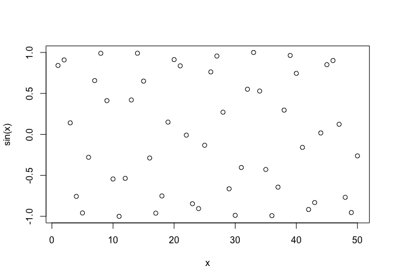

# My First R Script
Christopher Leone (A16731724)

``` r
# My first R script
x <- 1:50
plot(x, sin(x))
```



``` r
plot(x, sin(x), typ="c", col="blue"
     , lwd="3", xlab="Silly X Axis"
     , ylab="Sensible Y Axis")
```


