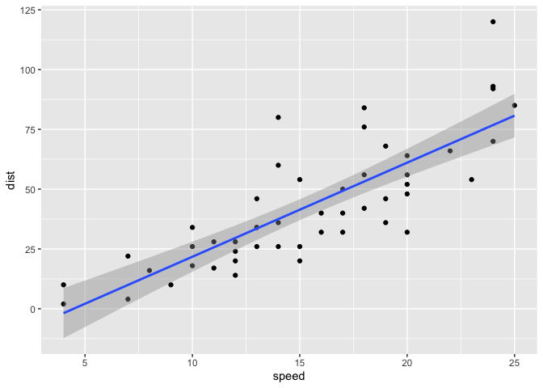
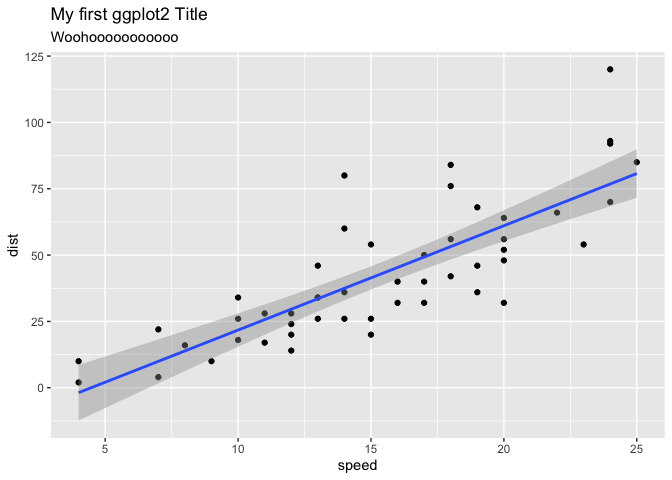
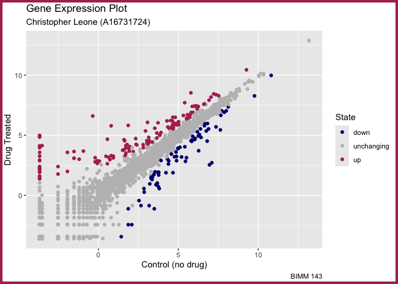
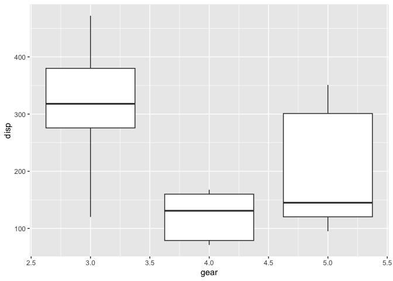
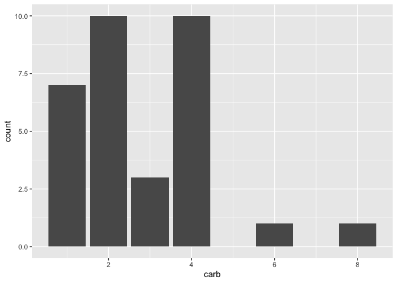
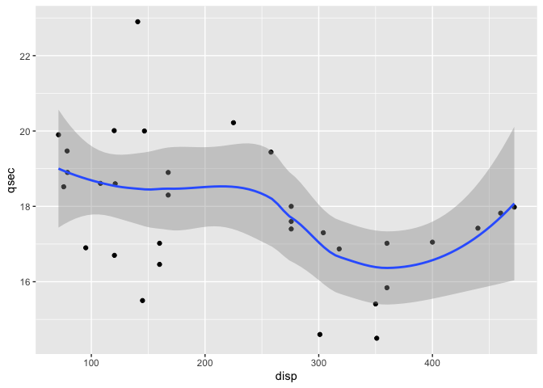
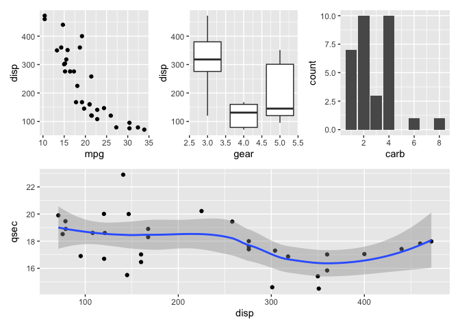
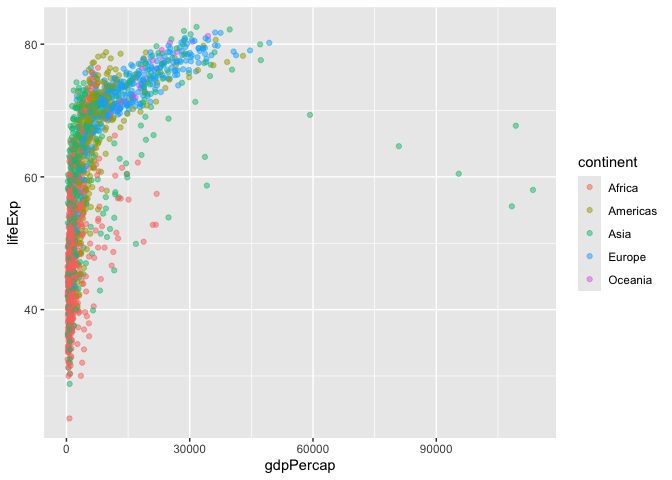
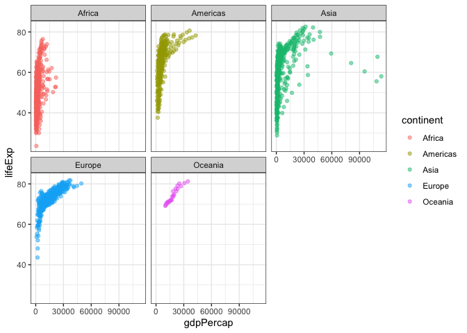

# Class 5: Data Visualization with GGplot
Christopher Leone (A16737124)

- [Background](#background)
  - [GGplot vs. “Base” R](#ggplot-vs-base-r)
  - [GGplot Components](#ggplot-components)
- [Using Different aes and geoms
  Parameters](#using-different-aes-and-geoms-parameters)
  - [Making a themed `genes` scatterplot with different
    `aes()`](#making-a-themed-genes-scatterplot-with-different-aes)
  - [Making Themed `cars` Plots with Different
    `geoms()`.](#making-themed-cars-plots-with-different-geoms)
- [Going further… The GapMinder
  Study](#going-further-the-gapminder-study)
  - [Making our initial plots…](#making-our-initial-plots)

# Background

There are many graphics systems available in R. These include “base” R
and tones of add-on packages such as **ggplot2**.

## GGplot vs. “Base” R

Let’s compare “base” and **ggplot2** briefly. We can use some example
data that is built-in with R called `cars`:

``` r
head(cars)
```

      speed dist
    1     4    2
    2     4   10
    3     7    4
    4     7   22
    5     8   16
    6     9   10

In base R, I can just call `plot()`:

``` r
plot(cars)
```


How can we do this with **ggplot2?**

First we need to install the package. We do this with
`install.packages("ggplot2")`. Since I only need to do this once, I will
do this in the base R console rather than in the .qmd window.

> Key point: I only install packages in the R console, not within quarto
> documents or R scripts.

Before I use any add-on package, I must load it up with a call to
`library()`.

``` r
library(ggplot2)
```

> I can also call a single function from an add-on using the function
> `addonName::function`.

## GGplot Components

Every ggplot has at least 3 things:

- The **data** (in our case, `cars`)
- The **aesthetics** (how the data maps to the plot)
- The **geometries** (determines how the plot is drawn, such as lines,
  points…)

``` r
ggplot(cars) +
  aes(x=speed, y=dist) +
  geom_point()
```


> For “simple” plots, ggplot is much more verbose than base R, but has
> nicer defaults and requires less arguments for formatting more complex
> plots.

Adding a line to show the relationship between the different variables
(i.e. add another “layer”):

``` r
ggplot(cars) +
  aes(x=speed, y=dist) +
  geom_point() + 
  geom_smooth(method="lm")
```

    `geom_smooth()` using formula = 'y ~ x'



And, adding a title and subtitle to the plot:

``` r
ggplot(cars) +
  aes(x=speed, y=dist) +
  geom_point() + 
  geom_smooth(method="lm") + 
  ggtitle(label = "My first ggplot2 Title", subtitle = "Woohooooooooooo")
```

    `geom_smooth()` using formula = 'y ~ x'



``` r
# can also use labs()
```

# Using Different aes and geoms Parameters

Read input data into R.

``` r
url <- "https://bioboot.github.io/bimm143_S20/class-material/up_down_expression.txt"
genes <- read.delim(url)
head(genes)
```

            Gene Condition1 Condition2      State
    1      A4GNT -3.6808610 -3.4401355 unchanging
    2       AAAS  4.5479580  4.3864126 unchanging
    3      AASDH  3.7190695  3.4787276 unchanging
    4       AATF  5.0784720  5.0151916 unchanging
    5       AATK  0.4711421  0.5598642 unchanging
    6 AB015752.4 -3.6808610 -3.5921390 unchanging

> 17) How many genes are in this dataset? 5196!

``` r
length(genes$Gene)
```

    [1] 5196

``` r
# Or, use nrow(gene)
```

> 17) What are the column names?

``` r
colnames(genes)
```

    [1] "Gene"       "Condition1" "Condition2" "State"     

> 17) How many “up” and “down” regulated genes are there?

``` r
table(genes$State)
```


          down unchanging         up 
            72       4997        127 

``` r
round(table(genes$State)/nrow(genes) * 100, 2)
```


          down unchanging         up 
          1.39      96.17       2.44 

## Making a themed `genes` scatterplot with different `aes()`

Create a scatterplot using `genes`. We will include a color scale and a
theme.

``` r
ggplot(genes) +
  aes(x=Condition1, y=Condition2, col=State) +
  scale_color_manual(values=c("navy","gray","maroon")) +
  geom_point() +
  labs(title = "Gene Expression Plot", 
       subtitle = "Christopher Leone (A16731724)", 
       caption = "BIMM 143",
       x = "Control (no drug)",
       y = "Drug Treated") +
  theme(plot.background = element_rect(color = "maroon", fill = NA, linewidth = 3))
```



## Making Themed `cars` Plots with Different `geoms()`.

Let’s plot some aspects of the in-built `mtcars` dataset.

> 17) Scatterplot of `mpg` vs. `disp`.

``` r
p1 <- ggplot(mtcars) +
  aes(x=mpg, y=disp) + 
  geom_point()
p1
```


> 17) Boxplot of `gear` vs `disp`

``` r
p2 <- ggplot(mtcars) + 
  aes(x=gear, y=disp, group=gear) + 
  geom_boxplot()
p2
```



> 17) Barplot of `carb`

``` r
p3 <- ggplot(mtcars) +
  aes(x=carb) + 
  geom_bar()
p3
```



> 17) Smooth of `disp` vs `qsec`

``` r
p4 <- ggplot(mtcars) +
  aes(x=disp, y=qsec) + 
  geom_point() +
  geom_smooth()
p4
```

    `geom_smooth()` using method = 'loess' and formula = 'y ~ x'



Now that I have all plots p1-p4, I want to combine these into one
multi-pane figure. We can do that here using **Patchwork**:

``` r
library(patchwork)
((p1 | p2 | p3) / p4)
```

    `geom_smooth()` using method = 'loess' and formula = 'y ~ x'



# Going further… The GapMinder Study

``` r
# File location online
url <- "https://raw.githubusercontent.com/jennybc/gapminder/master/inst/extdata/gapminder.tsv"

gapminder <- read.delim(url)
```

Taking a small peek at the data…

``` r
head(gapminder)
```

          country continent year lifeExp      pop gdpPercap
    1 Afghanistan      Asia 1952  28.801  8425333  779.4453
    2 Afghanistan      Asia 1957  30.332  9240934  820.8530
    3 Afghanistan      Asia 1962  31.997 10267083  853.1007
    4 Afghanistan      Asia 1967  34.020 11537966  836.1971
    5 Afghanistan      Asia 1972  36.088 13079460  739.9811
    6 Afghanistan      Asia 1977  38.438 14880372  786.1134

> 17) How many countries are in this dataset?

``` r
length(table(gapminder$country))
```

    [1] 142

## Making our initial plots…

Let’s start with a plot of GDP vs. Life Expectancy, colored by
continent.

``` r
ggplot(gapminder) +
  aes(x=gdpPercap, y=lifeExp, col=continent) +
  geom_point(alpha=0.5)
```



We can also facet the graph by a variable to make several panels. Let’s
sort the graph by continent…

``` r
ggplot(gapminder) +
  aes(x=gdpPercap, y=lifeExp, col=continent) +
  geom_point(alpha=0.5) + 
  facet_wrap(~continent) + 
  theme_bw()
```


