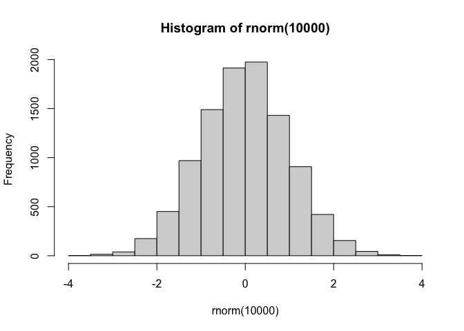
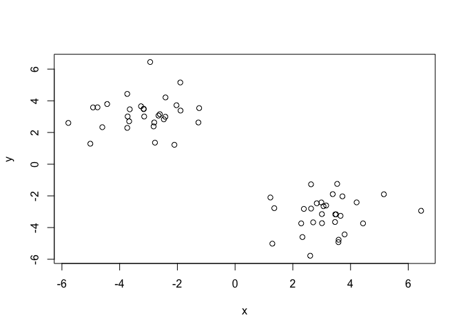
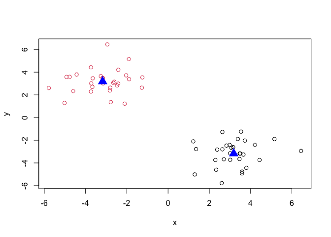
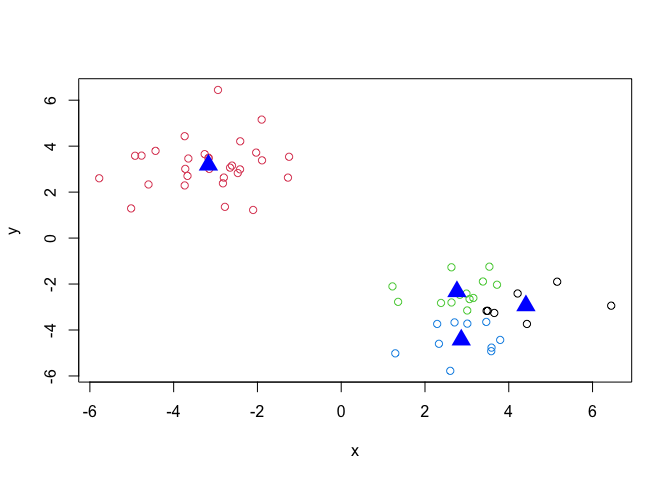
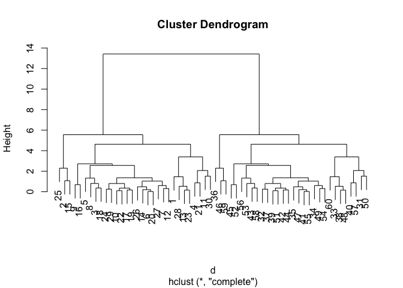
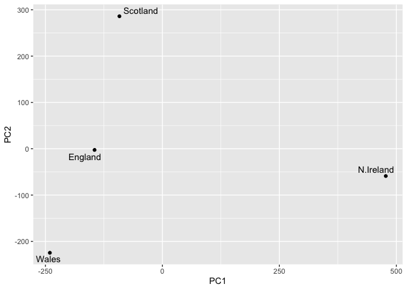
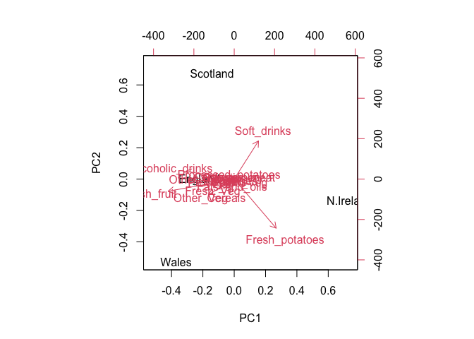

# Class 7: Machine Learning 1
Christopher Leone \| A16731724

- [Clustering](#clustering)
  - [K-means Clustering](#k-means-clustering)
  - [Hierarchical Clustering](#hierarchical-clustering)
- [Dimensionality \| Principal Component
  Analysis](#dimensionality--principal-component-analysis)
  - [Spotting Major Differences](#spotting-major-differences)
  - [PCA to the Rescue!](#pca-to-the-rescue)

> Today we will explore unsupervised machine learning methods starting
> with clustering and dimensionality reduction.

## Clustering

To start, let’s make up some data to cluster where we know what the
answer should be. The `rnorm()` function will help us here.

``` r
# This will create a histogram displaying 10000 randomly generated numbers.
hist(rnorm(10000))
```



And here, we create a plot with two clusters of data located at the
arbitrary x values of “-3” and “3”, with y values reversed.

``` r
# This binds the two rnorm() groups inside an object to plot
val <- c(rnorm(30, 3), rnorm(30, -3))
x <- cbind(x=val, y=rev(val))
plot(x)
```



### K-means Clustering

The main function in “base R” for K-means clustering is called
`kmeans()`:

``` r
# Only 'x' and 'centers' are required args for `kmeans()`
k <- kmeans(x, 2)
k
```

    K-means clustering with 2 clusters of sizes 30, 30

    Cluster means:
              x         y
    1  3.181395 -3.170371
    2 -3.170371  3.181395

    Clustering vector:
     [1] 1 1 1 1 1 1 1 1 1 1 1 1 1 1 1 1 1 1 1 1 1 1 1 1 1 1 1 1 1 1 2 2 2 2 2 2 2 2
    [39] 2 2 2 2 2 2 2 2 2 2 2 2 2 2 2 2 2 2 2 2 2 2

    Within cluster sum of squares by cluster:
    [1] 69.68988 69.68988
     (between_SS / total_SS =  89.7 %)

    Available components:

    [1] "cluster"      "centers"      "totss"        "withinss"     "tot.withinss"
    [6] "betweenss"    "size"         "iter"         "ifault"      

The `kmeans()` function returns a “list” with 9 components. You can see
the named components with the `attributes()` function.

``` r
# This lists the 9 attributes.
attributes(k)
```

    $names
    [1] "cluster"      "centers"      "totss"        "withinss"     "tot.withinss"
    [6] "betweenss"    "size"         "iter"         "ifault"      

    $class
    [1] "kmeans"

> 17) How many points are in each cluster?

``` r
# Size gives the size of each cluster.
k$size
```

    [1] 30 30

> 17) Cluster assignment/membership vector?

``` r
# This calls the vector for each cluster assignment.
k$cluster
```

     [1] 1 1 1 1 1 1 1 1 1 1 1 1 1 1 1 1 1 1 1 1 1 1 1 1 1 1 1 1 1 1 2 2 2 2 2 2 2 2
    [39] 2 2 2 2 2 2 2 2 2 2 2 2 2 2 2 2 2 2 2 2 2 2

> 17) Cluster centers?

``` r
# This returns the coordinates of the cluster centers.
k$centers
```

              x         y
    1  3.181395 -3.170371
    2 -3.170371  3.181395

> 17) Make a plot of our `kmeans()` results showing cluster assignment
>     with different colors for each group of points and centers in
>     blue.

``` r
# Col can also be a number, so we can set it equal to k$cluster.
plot(x, col=(k$cluster))
points(k$centers, col="blue", pch=17, cex=2)
```



> 17) Run `kmeans()` again on `x` and this time cluster into four groups
>     and plot the same result figure as above.

``` r
k2 <- kmeans(x,4)
plot(x, col=(k2$cluster))
points(k2$centers, col="blue", pch=17, cex=2)
```



> **Key Point**: K-means clustering is very popular but can be misused.
> One big limitation is that it can impose a clustering pattern on your
> data even if clear natural grouping doesn’t exist - i.e. it does what
> you tell it to do in terms of `centers`.

### Hierarchical Clustering

The main function in “base R” for hierarchical clustering is `hclust()`.

You can’t just pass our dataset into `hclust()`, more work is required,
but it is more flexible than `kmeans()`.

The results of `hclust()` don’t have a useful `print()` method but do
have a special `plot()` method.

``` r
# hclust() only has one required input, "d".
d <- dist(x)
h <- hclust(d)
plot(h)
```



To get our main cluster assignment (membership vector), we need to “cut”
the tree at the big “goalposts”…

> 17) How many large clusters are there?

``` r
# This will return our two original clusters!
grps <- cutree(h, h=8)
table(grps)
```

    grps
     1  2 
    30 30 

Hierarchical clustering is distinct in that the dendrogram can reveal
the potential grouping in your data, unlike `kmeans()`.

## Dimensionality \| Principal Component Analysis

PCA is a common and highly useful dimensionality reduction technique
used in many fields - particularly in bioinformatics.

Here we will analyze some data from the UK on food consumption.

``` r
url <- "https://tinyurl.com/UK-foods"
x <- read.csv(url)
head(x)
```

                   X England Wales Scotland N.Ireland
    1         Cheese     105   103      103        66
    2  Carcass_meat      245   227      242       267
    3    Other_meat      685   803      750       586
    4           Fish     147   160      122        93
    5 Fats_and_oils      193   235      184       209
    6         Sugars     156   175      147       139

> (Q1) How many rows and columns are in your new data frame named x?
> What R functions could you use to answer this questions?

``` r
dim(x)
```

    [1] 17  5

But what if we don’t want X to be counted as a column of data?

> (Q2) Here is the preferred solution, because it is does not
> continually delete column names each time the code is ran:

``` r
# This is a non-destructive method
x <- read.csv(url, row.names=1)
head(x)
```

                   England Wales Scotland N.Ireland
    Cheese             105   103      103        66
    Carcass_meat       245   227      242       267
    Other_meat         685   803      750       586
    Fish               147   160      122        93
    Fats_and_oils      193   235      184       209
    Sugars             156   175      147       139

…and the new dimensions:

``` r
dim(x)
```

    [1] 17  4

### Spotting Major Differences

First, let’s paste the original plot:

``` r
barplot(as.matrix(x), beside=T, col=rainbow(nrow(x)))
```


> (Q3) Changing what optional argument in the above barplot() function
> results in the following plot?

Let’s make this plot different by changing one parameter:

``` r
# "beside" makes a side-by-side barplot, we change it to "F".
barplot(as.matrix(x), beside=F, col=rainbow(nrow(x)))
```


This plot is still not very helpful, so lets try a different
conventional method — a “pairs” plot.

``` r
# But, this is still quite complicated...
pairs(x, col=rainbow(nrow(x)), pch=16)
```


### PCA to the Rescue!

The main function in “base R” for PCA is `prcomp()`:

``` r
# But, this function wants this data in a specific way.
# So, lets transpose our matrix:
pca <- prcomp(t(x))
summary(pca)
```

    Importance of components:
                                PC1      PC2      PC3       PC4
    Standard deviation     324.1502 212.7478 73.87622 2.921e-14
    Proportion of Variance   0.6744   0.2905  0.03503 0.000e+00
    Cumulative Proportion    0.6744   0.9650  1.00000 1.000e+00

The `prcomp()` function returns a list object of our results with 5
components, according to `attributes()`.

The two main results in here are `pca$x` and `pca$rotation`. The first
of these contains the scores of the data on the new PC axis, which we
use to make our PCA plot.

> (Q7) Complete the code below to generate a plot of PC1 vs PC2.

``` r
# Calling the gg libraries...
library(ggplot2)
library(ggrepel)

#...then making a ggplot of PC1 vs PC2.
ggplot(pca$x) +
  aes(PC1, PC2, label=rownames(pca$x)) +
  geom_point() +
  geom_text_repel()
```



> What we can gather from this is that Wales, England, and Scotland all
> fall neatly along the PC1 line, but N. Ireland is significantly
> different. Let’s see why:

We can also use `pca$rotation` to determine what in the data is leading
to the variation we see in our plot.

``` r
# Calling the library...
library(ggplot2)

# And creating the plot.
ggplot(pca$rotation) +
  aes(PC1, rownames(pca$rotation)) +
  geom_col()
```


By reading both PCA plots, we can determine that:

- N. Ireland is different because they consume considerably more fresh
  potatoes and soft drinks.
- The rest consume considerably more alcoholic drinks and fresh fruit.

Additionally, we can see this correlation with biplots. (`biplot()`
function)

``` r
# This is found in "base R".
biplot(pca)
```


