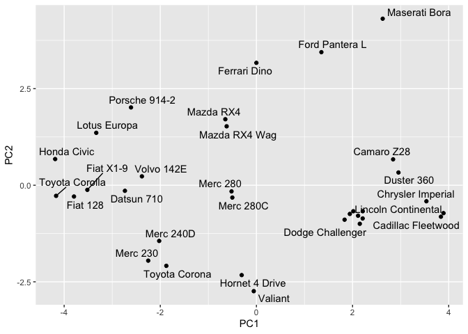
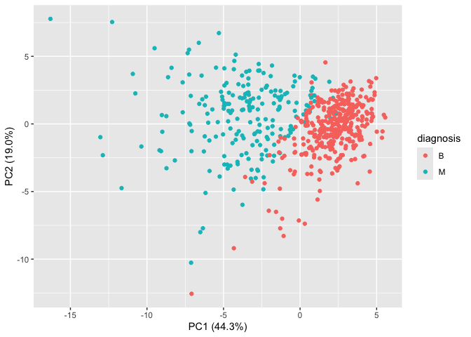
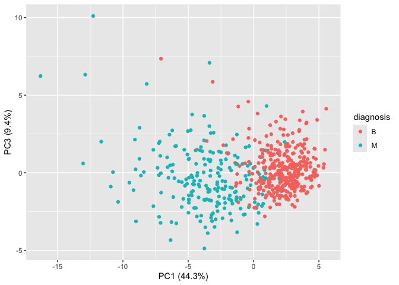

# Class 8 \| Breast Cancer Mini-Project
Christopher Leone \| A16731724

- [Background Information](#background-information)
- [Data Import](#data-import)
- [Clustering](#clustering)
- [Principal Component Analyses](#principal-component-analyses)
  - [Principal Component Analysis \|
    `mtcars`](#principal-component-analysis--mtcars)
  - [Principal Component Analysis \|
    `wisc.data`](#principal-component-analysis--wiscdata)
  - [Communicating PCA Results](#communicating-pca-results)
- [Combining Methods](#combining-methods)
  - [Clustering on PCA Results](#clustering-on-pca-results)
  - [Prediction](#prediction)

## Background Information

This source provides materials for a class mini-project focused on
unsupervised learning analysis of human breast cancer cell data.
Students will conduct principal component analysis (PCA) for
dimensionality reduction and then apply hierarchical and k-means
clustering techniques.

The project involves exploratory data analysis, interpreting PCA
results, evaluating clustering performance by comparing cluster
assignments to actual diagnoses, and optionally combining PCA with
clustering. The goal is to identify potential groupings within the cell
data based on their characteristics without prior knowledge of
malignancy, and the project concludes with an application of the PCA
model to classify new patient samples.

## Data Import

Our data comes from the U.Wisconsin Medical Center, and we will import
this `.csv` document from our class website.

``` r
# We do NOT want patient ID data, so we will manually remove it.
wisc.df <- read.csv("WisconsinCancer.csv", row.names = 1)
```

> (Q1) How many patients are in this dataset?

``` r
# Considering that each row designates one patient...
nrow(wisc.df)
```

    [1] 569

> (Q2) How many patients were given a malignant diagnosis?

``` r
# We can create a table here!
table(wisc.df$diagnosis)
```


      B   M 
    357 212 

> (Q3) How many variables/features in the data are suffixed with
> `_mean`?

``` r
# This tells us which columns have `_means`...
# And we can use `length()` to determine the number.
length(grep("_mean", colnames(wisc.df), value = TRUE))
```

    [1] 10

There is also a diagnosis column that is the clinician consensus—I want
to exclude this column from further analysis. We will come back later
and compare our results to this diagnosis.

``` r
# This first part creates a factor...
diagnosis <- as.factor(wisc.df$diagnosis)
head(diagnosis)
```

    [1] M M M M M M
    Levels: B M

``` r
# And here we can remove it from `wisc.df`.
wisc.data <- wisc.df[,-1]
```

## Clustering

Let’s try clustering with `hclust()`. But, results are quite messy, so
we will move on to PCA later.

``` r
# Here is what a hierarchical clustering would look like:
hc <- hclust(dist(wisc.data))
plot(hc)
```


``` r
# And we can try to extract clusters with membership:
grps <- cutree(hc, k=2)

# And how many we have in each group?
table(diagnosis, grps)
```

             grps
    diagnosis   1   2
            B 357   0
            M 192  20

The results here show us that there are 20 outliers, all of which are
within the “malignant” diagnostic group.

## Principal Component Analyses

### Principal Component Analysis \| `mtcars`

The main function for PCA in base R is `prcomp()`, where it has a
default input parameter of `scale=FALSE`.

``` r
# Here, we try out the function.
pc <- prcomp(mtcars, scale=F)
biplot(pc)
```


Let’s check out the mean values of each column and their standard
deviation.

``` r
# `colMeans()` will return the means.
colMeans(mtcars)
```

           mpg        cyl       disp         hp       drat         wt       qsec 
     20.090625   6.187500 230.721875 146.687500   3.596563   3.217250  17.848750 
            vs         am       gear       carb 
      0.437500   0.406250   3.687500   2.812500 

``` r
# We can use `apply()` to find the standard deviation.
apply(mtcars, 2, sd)
```

            mpg         cyl        disp          hp        drat          wt 
      6.0269481   1.7859216 123.9386938  68.5628685   0.5346787   0.9784574 
           qsec          vs          am        gear        carb 
      1.7869432   0.5040161   0.4989909   0.7378041   1.6152000 

By looking at these results, we see that many of these are on different
scales, so we can set `scale=TRUE` within `prcomp()` to account for
these differences.

``` r
# Using mtscale will have the exact same effect.
pc.scale <- prcomp(mtcars, scale=TRUE)
biplot(pc.scale)
```


We can also use a “loadings plot” to compare how the original variables
contribute to the new PCs.

``` r
# 'hp' and 'disp' are shown to have the greatest effect.
library(ggplot2)
ggplot(pc$rotation) +
  aes(PC1, rownames(pc$rotation)) +
  geom_col()
```


What about for the scaled data?

``` r
# We see that most variables have a similar effect.
library(ggplot2)
ggplot(pc.scale$rotation) +
  aes(PC1, rownames(pc.scale$rotation)) +
  geom_col()
```


And finally, let’s create a more understandable PC plot of our scaled
PCA results. We can use a `geom_point()` plot and call upon the
`ggrepel` library for better labeling.

``` r
# We can add a few settings to make a nicer plot.
library(ggrepel)
ggplot(pc.scale$x) +
  aes(PC1, PC2, label=rownames(pc.scale$x)) + 
  geom_point() +
  geom_text_repel()
```

    Warning: ggrepel: 6 unlabeled data points (too many overlaps). Consider
    increasing max.overlaps



> **Key point:** In general, we will set `scale=TRUE` when we do PCA.
> This is not the default, but probably should be…

### Principal Component Analysis \| `wisc.data`

Let’s begin to do the same with our `wisc.data` dataset.

``` r
wisc.pr <- prcomp(wisc.data, scale=TRUE)
plot(wisc.pr)
```


To see how well PCA is doing here in terms of capturing the variance, we
can use the `summary()` function.

``` r
summary(wisc.pr)
```

    Importance of components:
                              PC1    PC2     PC3     PC4     PC5     PC6     PC7
    Standard deviation     3.6444 2.3857 1.67867 1.40735 1.28403 1.09880 0.82172
    Proportion of Variance 0.4427 0.1897 0.09393 0.06602 0.05496 0.04025 0.02251
    Cumulative Proportion  0.4427 0.6324 0.72636 0.79239 0.84734 0.88759 0.91010
                               PC8    PC9    PC10   PC11    PC12    PC13    PC14
    Standard deviation     0.69037 0.6457 0.59219 0.5421 0.51104 0.49128 0.39624
    Proportion of Variance 0.01589 0.0139 0.01169 0.0098 0.00871 0.00805 0.00523
    Cumulative Proportion  0.92598 0.9399 0.95157 0.9614 0.97007 0.97812 0.98335
                              PC15    PC16    PC17    PC18    PC19    PC20   PC21
    Standard deviation     0.30681 0.28260 0.24372 0.22939 0.22244 0.17652 0.1731
    Proportion of Variance 0.00314 0.00266 0.00198 0.00175 0.00165 0.00104 0.0010
    Cumulative Proportion  0.98649 0.98915 0.99113 0.99288 0.99453 0.99557 0.9966
                              PC22    PC23   PC24    PC25    PC26    PC27    PC28
    Standard deviation     0.16565 0.15602 0.1344 0.12442 0.09043 0.08307 0.03987
    Proportion of Variance 0.00091 0.00081 0.0006 0.00052 0.00027 0.00023 0.00005
    Cumulative Proportion  0.99749 0.99830 0.9989 0.99942 0.99969 0.99992 0.99997
                              PC29    PC30
    Standard deviation     0.02736 0.01153
    Proportion of Variance 0.00002 0.00000
    Cumulative Proportion  1.00000 1.00000

> (Q4) From your results, what proportion of the original variance is
> captured by the first principal components (PC1)?

Thanks to `summary()`, we know that answer is **44.7%**.

> (Q5) How many principal components (PCs) are required to describe at
> least 70% of the original variance in the data?

Using up to **PC3** will cover ~72% of the variance in our data.

> (Q6) How many principal components (PCs) are required to describe at
> least 90% of the original variance in the data?

Using up to **PC7** will cover ~91% of the variance in our data.

Now, if we were to create a biplot of the data, it would be hard to
distinguish many results.

``` r
biplot(wisc.pr)
```


> (Q7) What stands out to you about this plot? Is it easy or difficult
> to understand? Why?

This plot is quite difficult to understand, and it is very cramped,
preventing any real conclusions from being drawn.

Let’s also create the main PC1 vs. PC2 figure, which according to
`summary()`, will capture 63.2% of the variance in our data.

``` r
# There's a separation between malignant and benign!
ggplot(wisc.pr$x) +
  aes(PC1, PC2, col=diagnosis) +
  geom_point() +
  xlab("PC1 (44.3%)") +
  ylab("PC2 (19.0%)")
```



> (Q8) Generate a similar plot for principal components 1 and 3. What do
> you notice about these plots?

``` r
# There's still a separation between malignant and benign!
ggplot(wisc.pr$x) +
  aes(PC1, PC3, col=diagnosis) +
  geom_point() +
  xlab("PC1 (44.3%)") +
  ylab("PC3 (9.4%)")
```



There is still a significant separation between malignant and benign
samples, but the graph is oriented differently.

### Communicating PCA Results

> (Q9) For the first principal component, what is the component of the
> loading vector (i.e. `wisc.pr$rotation[,1]`) for the feature
> `concave.points_mean`?

``` r
wisc.pr$rotation[,1]
```

                radius_mean            texture_mean          perimeter_mean 
                -0.21890244             -0.10372458             -0.22753729 
                  area_mean         smoothness_mean        compactness_mean 
                -0.22099499             -0.14258969             -0.23928535 
             concavity_mean     concave.points_mean           symmetry_mean 
                -0.25840048             -0.26085376             -0.13816696 
     fractal_dimension_mean               radius_se              texture_se 
                -0.06436335             -0.20597878             -0.01742803 
               perimeter_se                 area_se           smoothness_se 
                -0.21132592             -0.20286964             -0.01453145 
             compactness_se            concavity_se       concave.points_se 
                -0.17039345             -0.15358979             -0.18341740 
                symmetry_se    fractal_dimension_se            radius_worst 
                -0.04249842             -0.10256832             -0.22799663 
              texture_worst         perimeter_worst              area_worst 
                -0.10446933             -0.23663968             -0.22487053 
           smoothness_worst       compactness_worst         concavity_worst 
                -0.12795256             -0.21009588             -0.22876753 
       concave.points_worst          symmetry_worst fractal_dimension_worst 
                -0.25088597             -0.12290456             -0.13178394 

The component of the loading vector for `concave.points_mean` is
-0.26085376.

> (Q10) What is the minimum number of principal components required to
> explain 80% of the variance of the data?

Once again, with the help of `summary()`, we can determine that up to
**PC5** is needed to explain 80% of the variance in the data
(specifically, ~84%).

## Combining Methods

We can take our PCA results and use them as a “basis set” for other
analyses such as clustering.

``` r
# Let's create another hclust(), but what's the difference?
wisc.hc<- hclust(dist(wisc.pr$x[,1:2]), method="ward.D2")
plot(wisc.hc)
```


Despite the data still being quite compact in this plot, we can see that
there are two major clusters. We can also “cut” this tree to yield our
clusters in this way:

``` r
pc.grps <- cutree(wisc.hc, k=2)
table(pc.grps)
```

    pc.grps
      1   2 
    195 374 

How do my cluster `grps` compare to the clinician diagnoses?

### Clustering on PCA Results

> (Q15) How well does the newly created model with four clusters
> separate out the two diagnoses?

``` r
table(diagnosis, pc.grps)
```

             pc.grps
    diagnosis   1   2
            B  18 339
            M 177  35

What this is telling us is that the vast majority of malignant samples
reside in cluster 1, and the majority of benign samples reside in
cluster 2. It separates the two diagnoses quite well—certainly better
than before.

> (Q16) How well do the k-means and hierarchical clustering models you
> created in previous sections (i.e. before PCA) do in terms of
> separating the diagnoses? Again, use the table() function to compare
> the output of each model (wisc.km\$cluster and wisc.hclust.clusters)
> with the vector containing the actual diagnoses.

First, let’s do both a K-means clustering and `hclust()` to store new
objects.

``` r
# Here, we define the two objects for older clustering methods.
wisc.km <- kmeans(wisc.data, centers=2)
wisc.hclust.clusters <- cutree(wisc.hc, k=4)
```

If we return `table()`s here with the results from those clustering
models…

``` r
# These are the K-means and H-clustering tables.
table(wisc.km$cluster, diagnosis)
```

       diagnosis
          B   M
      1 356  82
      2   1 130

``` r
table(wisc.hclust.clusters, diagnosis)
```

                        diagnosis
    wisc.hclust.clusters   B   M
                       1   0 112
                       2  18  65
                       3 232  18
                       4 107  17

We see that the number of samples situated in the non-majority clusters
is much larger, which proves that PCA separates the diagnoses much more
accurately.

### Prediction

> (Q18) Which of these new patients should we prioritize for follow up
> based on your results?

We can use our PCA model for the analysis of new “unseen” data. In this
case from U.Michigan…

``` r
#url <- "new_samples.csv"
url <- "https://tinyurl.com/new-samples-CSV"
new <- read.csv(url)
npc <- predict(wisc.pr, newdata=new)
npc
```

               PC1       PC2        PC3        PC4       PC5        PC6        PC7
    [1,]  2.576616 -3.135913  1.3990492 -0.7631950  2.781648 -0.8150185 -0.3959098
    [2,] -4.754928 -3.009033 -0.1660946 -0.6052952 -1.140698 -1.2189945  0.8193031
                PC8       PC9       PC10      PC11      PC12      PC13     PC14
    [1,] -0.2307350 0.1029569 -0.9272861 0.3411457  0.375921 0.1610764 1.187882
    [2,] -0.3307423 0.5281896 -0.4855301 0.7173233 -1.185917 0.5893856 0.303029
              PC15       PC16        PC17        PC18        PC19       PC20
    [1,] 0.3216974 -0.1743616 -0.07875393 -0.11207028 -0.08802955 -0.2495216
    [2,] 0.1299153  0.1448061 -0.40509706  0.06565549  0.25591230 -0.4289500
               PC21       PC22       PC23       PC24        PC25         PC26
    [1,]  0.1228233 0.09358453 0.08347651  0.1223396  0.02124121  0.078884581
    [2,] -0.1224776 0.01732146 0.06316631 -0.2338618 -0.20755948 -0.009833238
                 PC27        PC28         PC29         PC30
    [1,]  0.220199544 -0.02946023 -0.015620933  0.005269029
    [2,] -0.001134152  0.09638361  0.002795349 -0.019015820

If we plot our two new patients along with what we have…

``` r
# Here, we are instead using a "base R" function as provided from the lab sheet.
plot(wisc.pr$x[,1:2], col=diagnosis)
points(npc[,1], npc[,2], col="blue", pch=16, cex=3)
text(npc[,1], npc[,2], c(1,2), col="white")
```


…we see that patient 1 sits firmly within the benign group, but patient
2 is clearly past the separation between benign and malignant diagnoses.
Therefore, we should prioritize **Patient 2** for follow-up, as the
statistics point towards the growth being malignant.
