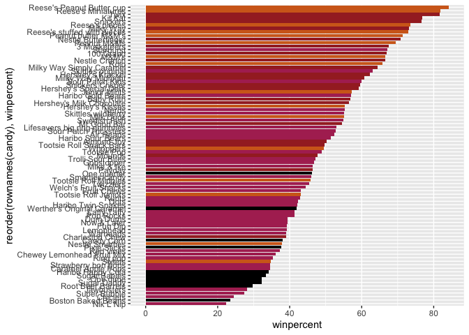
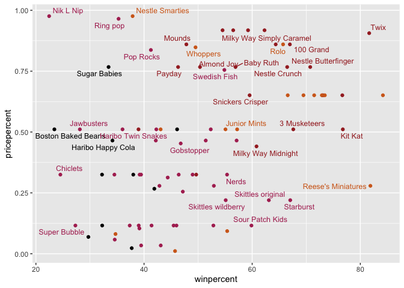
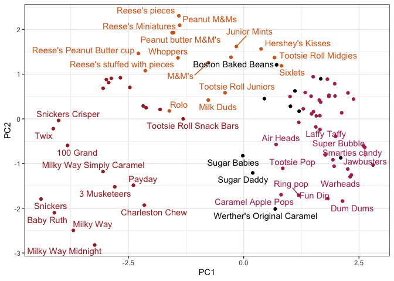

# Class 9 \| Halloween Mini-Project
Christopher Leone \| A16731724

- [Background](#background)
- [What is your favorite candy?](#what-is-your-favorite-candy)
- [Overall Candy Rankings](#overall-candy-rankings)
  - [Making a Barplot](#making-a-barplot)
- [Taking a look at `pricepercent`](#taking-a-look-at-pricepercent)
- [Exploring the Correlation
  Structure](#exploring-the-correlation-structure)
- [Principal Component Analysis](#principal-component-analysis)

## Background

Today we will take a step back to some data we can taste and explore—we
will examine the correlation structure and principal components of some
Halloween candy.

``` r
# Let's read the data into our project:
candy <- read.csv("candy-data.csv", row.names=1)
head(candy)
```

                 chocolate fruity caramel peanutyalmondy nougat crispedricewafer
    100 Grand            1      0       1              0      0                1
    3 Musketeers         1      0       0              0      1                0
    One dime             0      0       0              0      0                0
    One quarter          0      0       0              0      0                0
    Air Heads            0      1       0              0      0                0
    Almond Joy           1      0       0              1      0                0
                 hard bar pluribus sugarpercent pricepercent winpercent
    100 Grand       0   1        0        0.732        0.860   66.97173
    3 Musketeers    0   1        0        0.604        0.511   67.60294
    One dime        0   0        0        0.011        0.116   32.26109
    One quarter     0   0        0        0.011        0.511   46.11650
    Air Heads       0   0        0        0.906        0.511   52.34146
    Almond Joy      0   1        0        0.465        0.767   50.34755

> (Q1) How many different candy types are in this dataset?

``` r
# Shows that we have 85 entries.
nrow(candy)
```

    [1] 85

> (Q2) How many fruity candy types are in the dataset?

``` r
# 38 fruity candies!
sum(candy$fruity)
```

    [1] 38

## What is your favorite candy?

> (Q3) What is your favorite candy in the dataset and what is it’s
> winpercent value?

My favorite Halloween candy are the Nestle Crunch candies. How popular
is it?

``` r
candy["Nestle Crunch",]$winpercent
```

    [1] 66.47068

> (Q4) What is the winpercent value for “Kit Kat”?

``` r
candy["Kit Kat",]$winpercent
```

    [1] 76.7686

> (Q5) What is the winpercent value for “Tootsie Roll Snack Bars”?

``` r
candy["Tootsie Roll Snack Bars",]$winpercent
```

    [1] 49.6535

A helpful function we can use to get a summary of a dataset is the
`skim()` function from the **skimr** package, which we downloaded and
can call to examine our `candy` dataset.

``` r
library(skimr)
skim(candy)
```

|                                                  |       |
|:-------------------------------------------------|:------|
| Name                                             | candy |
| Number of rows                                   | 85    |
| Number of columns                                | 12    |
| \_\_\_\_\_\_\_\_\_\_\_\_\_\_\_\_\_\_\_\_\_\_\_   |       |
| Column type frequency:                           |       |
| numeric                                          | 12    |
| \_\_\_\_\_\_\_\_\_\_\_\_\_\_\_\_\_\_\_\_\_\_\_\_ |       |
| Group variables                                  | None  |

Data summary

**Variable type: numeric**

| skim_variable | n_missing | complete_rate | mean | sd | p0 | p25 | p50 | p75 | p100 | hist |
|:---|---:|---:|---:|---:|---:|---:|---:|---:|---:|:---|
| chocolate | 0 | 1 | 0.44 | 0.50 | 0.00 | 0.00 | 0.00 | 1.00 | 1.00 | ▇▁▁▁▆ |
| fruity | 0 | 1 | 0.45 | 0.50 | 0.00 | 0.00 | 0.00 | 1.00 | 1.00 | ▇▁▁▁▆ |
| caramel | 0 | 1 | 0.16 | 0.37 | 0.00 | 0.00 | 0.00 | 0.00 | 1.00 | ▇▁▁▁▂ |
| peanutyalmondy | 0 | 1 | 0.16 | 0.37 | 0.00 | 0.00 | 0.00 | 0.00 | 1.00 | ▇▁▁▁▂ |
| nougat | 0 | 1 | 0.08 | 0.28 | 0.00 | 0.00 | 0.00 | 0.00 | 1.00 | ▇▁▁▁▁ |
| crispedricewafer | 0 | 1 | 0.08 | 0.28 | 0.00 | 0.00 | 0.00 | 0.00 | 1.00 | ▇▁▁▁▁ |
| hard | 0 | 1 | 0.18 | 0.38 | 0.00 | 0.00 | 0.00 | 0.00 | 1.00 | ▇▁▁▁▂ |
| bar | 0 | 1 | 0.25 | 0.43 | 0.00 | 0.00 | 0.00 | 0.00 | 1.00 | ▇▁▁▁▂ |
| pluribus | 0 | 1 | 0.52 | 0.50 | 0.00 | 0.00 | 1.00 | 1.00 | 1.00 | ▇▁▁▁▇ |
| sugarpercent | 0 | 1 | 0.48 | 0.28 | 0.01 | 0.22 | 0.47 | 0.73 | 0.99 | ▇▇▇▇▆ |
| pricepercent | 0 | 1 | 0.47 | 0.29 | 0.01 | 0.26 | 0.47 | 0.65 | 0.98 | ▇▇▇▇▆ |
| winpercent | 0 | 1 | 50.32 | 14.71 | 22.45 | 39.14 | 47.83 | 59.86 | 84.18 | ▃▇▆▅▂ |

> (Q6) Is there any variable/column that looks to be on a different
> scale to the majority of the other columns in the dataset?

The **winpercent** column appears to be on a different scale because it
is the only column without values consistently below 1.

> (Q7) What do you think a zero and one represent for the
> candy\$chocolate column?

Each “zero” represents a “No/FALSE”, while each “one” represents a
“Yes/TRUE”, such as in binary code.

> (Q8) Plot a histogram of winpercent values.

``` r
# Let's just generate a simple histogram here
hist(candy$winpercent)
```


> (Q9) Is the distribution of winpercent values symmetrical?

No, the distribution is swayed to the left, closer to lower
`candy$winpercent` values.

> (Q10) Is the center of the distribution above or below 50%?

As alluded to in **Q8**, the center of the distribution is below 50%.

> (Q11) On average is chocolate candy higher or lower ranked than fruit
> candy?

Let’s check the values for each:

``` r
# Here is the mean value for chocolate candy:
mean(candy$winpercent[as.logical(candy$chocolate)])
```

    [1] 60.92153

``` r
# And here is the mean for fruity candy:
mean(candy$winpercent[as.logical(candy$fruity)])
```

    [1] 44.11974

We can see that chocolate candy has **~16%** higher `winpercent` values
than fruity candy.

> (Q12) Is this difference statistically significant?

``` r
# We can use a T-test to find the p-value and significance:
t.test(x=candy$winpercent[as.logical(candy$chocolate)],y=candy$winpercent[as.logical(candy$fruity)])
```


        Welch Two Sample t-test

    data:  candy$winpercent[as.logical(candy$chocolate)] and candy$winpercent[as.logical(candy$fruity)]
    t = 6.2582, df = 68.882, p-value = 2.871e-08
    alternative hypothesis: true difference in means is not equal to 0
    95 percent confidence interval:
     11.44563 22.15795
    sample estimates:
    mean of x mean of y 
     60.92153  44.11974 

We get a very small p-value of **2.871e-08**, which indicates a very
statistically significant difference between the `winpercent` of
chocolate and fruity candies.

## Overall Candy Rankings

We can make this easier by ordering the data by `winpercent`, which
would allow us to see the most/least liked candies.

> (Q13) What are the five least liked candy types in this set?

There are two related functions that can help here, one is the classic
`sort()` function and the `order()` function. But, here let’s play with
the `dplyr` package.

``` r
# Let's experiment with the dplyr package!
library(dplyr)
```


    Attaching package: 'dplyr'

    The following objects are masked from 'package:stats':

        filter, lag

    The following objects are masked from 'package:base':

        intersect, setdiff, setequal, union

``` r
candy %>% arrange(winpercent) %>% head(5)
```

                       chocolate fruity caramel peanutyalmondy nougat
    Nik L Nip                  0      1       0              0      0
    Boston Baked Beans         0      0       0              1      0
    Chiclets                   0      1       0              0      0
    Super Bubble               0      1       0              0      0
    Jawbusters                 0      1       0              0      0
                       crispedricewafer hard bar pluribus sugarpercent pricepercent
    Nik L Nip                         0    0   0        1        0.197        0.976
    Boston Baked Beans                0    0   0        1        0.313        0.511
    Chiclets                          0    0   0        1        0.046        0.325
    Super Bubble                      0    0   0        0        0.162        0.116
    Jawbusters                        0    1   0        1        0.093        0.511
                       winpercent
    Nik L Nip            22.44534
    Boston Baked Beans   23.41782
    Chiclets             24.52499
    Super Bubble         27.30386
    Jawbusters           28.12744

The 5 least liked candies in the dataset are “Nik L Nip”, “Boston Baked
Beans”, “Chiclets”, “Super Bubble”, and “Jawbusters”.

> (Q14) What are the top 5 all time favorite candy types out of this
> set?

To solve this in a similar manner, we can use the `tail()` function.

``` r
# Let's experiment with the dplyr package!
library(dplyr)
candy %>% arrange(winpercent) %>% tail(5)
```

                              chocolate fruity caramel peanutyalmondy nougat
    Snickers                          1      0       1              1      1
    Kit Kat                           1      0       0              0      0
    Twix                              1      0       1              0      0
    Reese's Miniatures                1      0       0              1      0
    Reese's Peanut Butter cup         1      0       0              1      0
                              crispedricewafer hard bar pluribus sugarpercent
    Snickers                                 0    0   1        0        0.546
    Kit Kat                                  1    0   1        0        0.313
    Twix                                     1    0   1        0        0.546
    Reese's Miniatures                       0    0   0        0        0.034
    Reese's Peanut Butter cup                0    0   0        0        0.720
                              pricepercent winpercent
    Snickers                         0.651   76.67378
    Kit Kat                          0.511   76.76860
    Twix                             0.906   81.64291
    Reese's Miniatures               0.279   81.86626
    Reese's Peanut Butter cup        0.651   84.18029

According to the data, the 5 most liked candies are “Reese’s Peanut
Butter Cups”, “Reese’s Miniatures”, “Twix”, “Kit Kat”, and “Snickers”.

### Making a Barplot

Let’s make an intricate barplot to analyze the overall rankings of the
candy. We will start simple and build from there.

> (Q15) Make a first barplot of candy ranking based on winpercent
> values.

``` r
library(ggplot2)
ggplot(candy) +
  aes(winpercent, rownames(candy)) +
  geom_col()
```


> (Q16) This is quite ugly, use the reorder() function to get the bars
> sorted by `winpercent`.

We can use the `reorder()` function within the `aes()` part of creating
a **ggplot** by giving it a variable to sort by.

``` r
ggplot(candy) +
  aes(winpercent, reorder(rownames(candy), winpercent)) + 
  geom_col()
```


I can make it even prettier by adding colors to the bars. Let’s color by
candy type *(the code is borrowed from the Class Lab worksheet)*, and
reprint the barplot.

``` r
# Here we define our color categories,
my_cols=rep("black", nrow(candy))
my_cols[as.logical(candy$chocolate)] = "chocolate"
my_cols[as.logical(candy$bar)] = "brown"
my_cols[as.logical(candy$fruity)] = "maroon"

# And here we reprint our barplot.
ggplot(candy) + 
  aes(winpercent, reorder(rownames(candy),winpercent)) +
  geom_col(fill=my_cols) 
```



``` r
# Why not save it?
ggsave("my_ugly_barplot.png", width=6, height=9)
```

Using our new colored plot…

> (Q17) What is the worst ranked chocolate candy?

The lowest ranked chocolate candy is “Sixlets”.

> (Q18) What is the best ranked fruity candy?

The highest ranked fruity candy is “Starburst”.

## Taking a look at `pricepercent`

Let’s compare `pricepercent` and `winpercent` to see which candy will
give us the greatest bang for our buck. We want lower `pricepercent` and
higher `winpercent`.

``` r
library(ggrepel)

# How about a plot of price vs win?
ggplot(candy) +
  aes(winpercent, pricepercent, label=rownames(candy)) +
  geom_point(col=my_cols) + 
  geom_text_repel(col=my_cols, size=3.3, max.overlaps = 5)
```

    Warning: ggrepel: 50 unlabeled data points (too many overlaps). Consider
    increasing max.overlaps



> (Q19) Which candy type is the highest ranked in terms of winpercent
> for the least money - i.e. offers the most bang for your buck?

``` r
ord <- order(candy$winpercent, decreasing = TRUE)
head(candy[ord,c(11,12)], n=5)
```

                              pricepercent winpercent
    Reese's Peanut Butter cup        0.651   84.18029
    Reese's Miniatures               0.279   81.86626
    Twix                             0.906   81.64291
    Kit Kat                          0.511   76.76860
    Snickers                         0.651   76.67378

We can see that the best candies with regards to both `pricepercent` and
`winpercent` are **Reese’s Miniatures**.

> (Q20) What are the top 5 most expensive candy types in the dataset and
> of these which is the least popular?

``` r
ord <- order(candy$pricepercent, decreasing = TRUE)
head(candy[ord,c(11,12)], n=5)
```

                             pricepercent winpercent
    Nik L Nip                       0.976   22.44534
    Nestle Smarties                 0.976   37.88719
    Ring pop                        0.965   35.29076
    Hershey's Krackel               0.918   62.28448
    Hershey's Milk Chocolate        0.918   56.49050

The top 5 most expensive candy types are **Nik L Nip, Nestle Smarties,
Ring Pops, Hershey’s Krackel, and Hershey’s Milk Chocolate**. Out of
these 5, the least popular is **Nik L Nip**, which is also the most
expensive! Not a great choice…

## Exploring the Correlation Structure

Let’s check the correlation between different candy characteristics to
see what we can find.

``` r
# We have to download the `corrplot` library first
c <- cor(candy)
corrplot::corrplot(c)
```


> (Q22) Examining this plot what two variables are anti-correlated
> (i.e. have minus values)?

The strongest anti-correlation on this plot is between **chocolate** and
**fruity**, with a **-0.74** correlation.

> (Q23) Similarly, what two variables are most positively correlated?

Outside of the 1.00 correlation between the same variable, the greatest
positive correlation is between **chocolate** and **winpercent**, with a
**+0.64** correlation.

## Principal Component Analysis

We need to be sure to scale our data, because we recall that
`winpercent` is on a different scale than the rest of the data.

``` r
# Our first two PCAs only account for 47%...
pca <- prcomp(candy, scale=T)
summary(pca)
```

    Importance of components:
                              PC1    PC2    PC3     PC4    PC5     PC6     PC7
    Standard deviation     2.0788 1.1378 1.1092 1.07533 0.9518 0.81923 0.81530
    Proportion of Variance 0.3601 0.1079 0.1025 0.09636 0.0755 0.05593 0.05539
    Cumulative Proportion  0.3601 0.4680 0.5705 0.66688 0.7424 0.79830 0.85369
                               PC8     PC9    PC10    PC11    PC12
    Standard deviation     0.74530 0.67824 0.62349 0.43974 0.39760
    Proportion of Variance 0.04629 0.03833 0.03239 0.01611 0.01317
    Cumulative Proportion  0.89998 0.93832 0.97071 0.98683 1.00000

First, lets make a “PCA plot”:

``` r
ggplot(pca$x) +
  aes(PC1, PC2, label=rownames(pca$x)) +
  geom_point(col=my_cols) +
  geom_text_repel(max.overlaps = 6, col=my_cols) +
  theme_bw()
```

    Warning: ggrepel: 43 unlabeled data points (too many overlaps). Consider
    increasing max.overlaps



The second main PCA result is in the `pca$rotation` object; we can plot
this to generate a so-called “loadings” plot.

``` r
ggplot(pca$rotation) +
  aes(PC1, reorder(rownames(pca$rotation), PC1), fill=PC1) +
  geom_col()
```


> (Q24) What original variables are picked up strongly by PC1 in the
> positive direction? Do these make sense to you?

The strongest positively correlated variables with PC1 are **fruity,
pluribus, and hard**. This makes sense, because many fruity candies come
in packs with more than one candy, and are often also hard candies.
