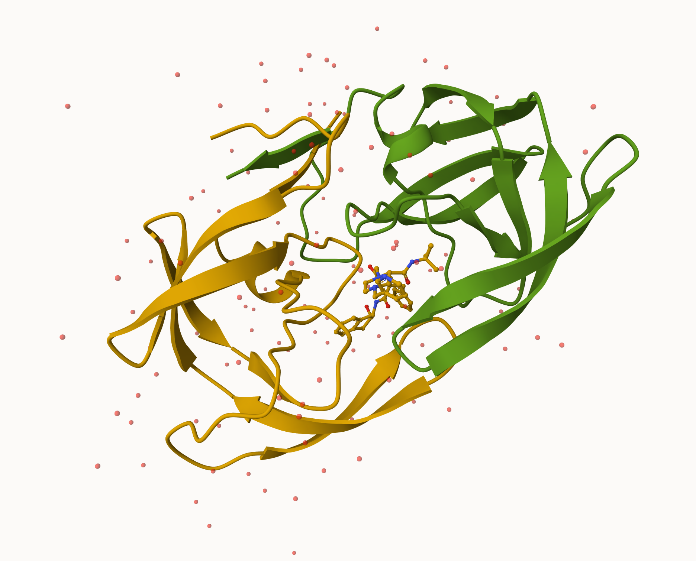
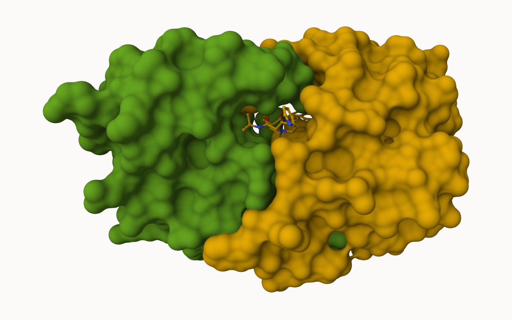
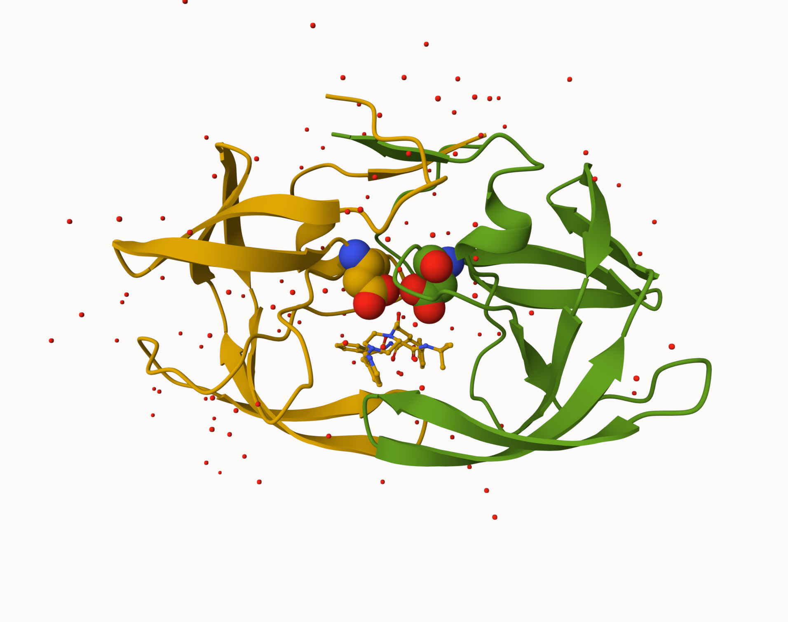

# Class 10 \| Structural Bioinformatics Part 1
Christopher Leone \| A16731724

- [Introduction to the RCSB Protein Data Bank
  (PDB)](#introduction-to-the-rcsb-protein-data-bank-pdb)
- [Visualizing the HIV-1 protease
  structure](#visualizing-the-hiv-1-protease-structure)
- [Introduction to Bio3D in R](#introduction-to-bio3d-in-r)
  - [Predicting functional motions of a single
    structure](#predicting-functional-motions-of-a-single-structure)

## Introduction to the RCSB Protein Data Bank (PDB)

The main repository of biomolecular structure data is called the
[Protein Data Bank](https://www.rcsb.org/) (PDB). It is the second
oldest database in all of bioinformatics, after GenBank.

What is currently in the PDB? We can access current composition stats
[here](https://www.rcsb.org/stats/summary)

> (Q1) What percentage of structures in the PDB are solved by X-Ray and
> Electron Microscopy.

``` r
# First, let's read the .csv file into our R project. 
p <- read.csv("class10data.csv", row.names = 1)
head(p)
```

                              X.ray     EM    NMR Multiple.methods Neutron Other
    Protein (only)          171,959 18,083 12,622              210      84    32
    Protein/Oligosaccharide  10,018  2,968     34               10       2     0
    Protein/NA                8,847  5,376    286                7       0     0
    Nucleic acid (only)       2,947    185  1,535               14       3     1
    Other                       170     10     33                0       0     0
    Oligosaccharide (only)       11      0      6                1       0     4
                              Total
    Protein (only)          202,990
    Protein/Oligosaccharide  13,032
    Protein/NA               14,516
    Nucleic acid (only)       4,685
    Other                       213
    Oligosaccharide (only)       22

Let’s create a new `function()` to make the process of changing data
from characters to integers easier.

``` r
# Next, we have to change the data from <chr> to <int>:
pdbInt <- function(x){
  y <- gsub(",", "", x)
  return(sum(as.numeric(y)))
}

# Let's use our new function to do make our sums:
xray.sum <- pdbInt(p$X.ray)
em.sum <- pdbInt(p$EM)
total.sum <- pdbInt(p$Total)

# And finally, our calculation:
((xray.sum + em.sum)/total.sum)*100
```

    [1] 93.6787

Through all of this work, we find that X-ray and Electron Microscopy
account for **93.67%** of structures in the PDB.

> (Q2) What proportion of structures in the PDB are protein?

``` r
protein <- pdbInt(p["Protein (only)", "Total"])
totals <- pdbInt(p$Total)
(protein/totals)*100
```

    [1] 86.2107

This tells us that proteins make up 86.2% of all structures in the PDB.

> (Q3) Type HIV in the PDB website search box on the home page and
> determine how many HIV-1 protease structures are in the current PDB?

**SKIPPED QUESTION**

## Visualizing the HIV-1 protease structure

Let’s explore the HIV-1 protease structure with the PDB code `1HSG`. We
will use the [Mol-star viewer](https://molstar.org/).



And here, we will use a spacefill representation around the ligand to
show the cavity where the **MK1** ligand binds.



Within this cavity, we have the most expensive water molecule in the
world! We can see it here:


Shown in spacefill representation are the crucial ASP25 residues found
in both chains:



## Introduction to Bio3D in R

The `bio3d` package is focused on structural bioinformatics analysis and
allows us to read and analyze PDB data.

``` r
library(bio3d)

# Let's read in some structure data:
hsg <- read.pdb("1HSG")
```

      Note: Accessing on-line PDB file

``` r
hsg
```


     Call:  read.pdb(file = "1HSG")

       Total Models#: 1
         Total Atoms#: 1686,  XYZs#: 5058  Chains#: 2  (values: A B)

         Protein Atoms#: 1514  (residues/Calpha atoms#: 198)
         Nucleic acid Atoms#: 0  (residues/phosphate atoms#: 0)

         Non-protein/nucleic Atoms#: 172  (residues: 128)
         Non-protein/nucleic resid values: [ HOH (127), MK1 (1) ]

       Protein sequence:
          PQITLWQRPLVTIKIGGQLKEALLDTGADDTVLEEMSLPGRWKPKMIGGIGGFIKVRQYD
          QILIEICGHKAIGTVLVGPTPVNIIGRNLLTQIGCTLNFPQITLWQRPLVTIKIGGQLKE
          ALLDTGADDTVLEEMSLPGRWKPKMIGGIGGFIKVRQYDQILIEICGHKAIGTVLVGPTP
          VNIIGRNLLTQIGCTLNF

    + attr: atom, xyz, seqres, helix, sheet,
            calpha, remark, call

Let’s take a look at the `hsg` attributes:

``` r
attributes(hsg)
```

    $names
    [1] "atom"   "xyz"    "seqres" "helix"  "sheet"  "calpha" "remark" "call"  

    $class
    [1] "pdb" "sse"

From this, we see that we can see atom data with `hsg$atom`:

``` r
head(hsg$atom)
```

      type eleno elety  alt resid chain resno insert      x      y     z o     b
    1 ATOM     1     N <NA>   PRO     A     1   <NA> 29.361 39.686 5.862 1 38.10
    2 ATOM     2    CA <NA>   PRO     A     1   <NA> 30.307 38.663 5.319 1 40.62
    3 ATOM     3     C <NA>   PRO     A     1   <NA> 29.760 38.071 4.022 1 42.64
    4 ATOM     4     O <NA>   PRO     A     1   <NA> 28.600 38.302 3.676 1 43.40
    5 ATOM     5    CB <NA>   PRO     A     1   <NA> 30.508 37.541 6.342 1 37.87
    6 ATOM     6    CG <NA>   PRO     A     1   <NA> 29.296 37.591 7.162 1 38.40
      segid elesy charge
    1  <NA>     N   <NA>
    2  <NA>     C   <NA>
    3  <NA>     C   <NA>
    4  <NA>     O   <NA>
    5  <NA>     C   <NA>
    6  <NA>     C   <NA>

And we can use `pdbseq()` to get the protein sequence:

``` r
head(pdbseq(hsg))
```

      1   2   3   4   5   6 
    "P" "Q" "I" "T" "L" "W" 

Now, I want to visualize the protein within my Quarto document, so we
will make use of some packages.

``` r
# Let's load two external packages...
library(bio3dview)
library(NGLVieweR)

# Then we can use `view.pdb()` to view the protein.
view.pdb(hsg) |>
  setSpin()
```

Let’s make it even more visually useful—let’s highlight the
catalytically active D25 residue.

``` r
# Select the important ASP 25 residue
sele <- atom.select(hsg, resno=25)

# and highlight them in spacefill representation
view.pdb(hsg, cols=c("navy","teal"), 
         highlight = sele,
         highlight.style = "spacefill") |>
  setRock()
```

### Predicting functional motions of a single structure

We can finish today with a bioinformatics prediction of the functional
motions of a protein. We will do this by using a Normal Mode Analysis
(NMA).

``` r
adk <- read.pdb("6s36")
```

      Note: Accessing on-line PDB file
       PDB has ALT records, taking A only, rm.alt=TRUE

``` r
# Let's run the NMA:
m <- nma(adk)
```

     Building Hessian...        Done in 0.017 seconds.
     Diagonalizing Hessian...   Done in 0.375 seconds.

``` r
plot(m)
```


The NMA plots hint that the greatest activity occurs between approximate
residues 125-165. Let’s take a look with some other views.

``` r
view.nma(m)
```

We can also generate a trajectory movie of the predicted dynamics and
view this in Mol-star.

``` r
# The mktrj() function allows for these animations.
mktrj(m, file="nma.pdb")
```
