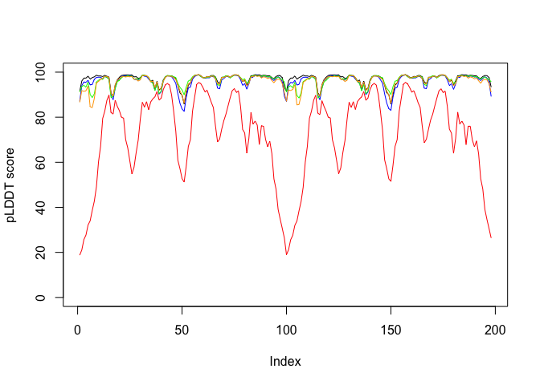
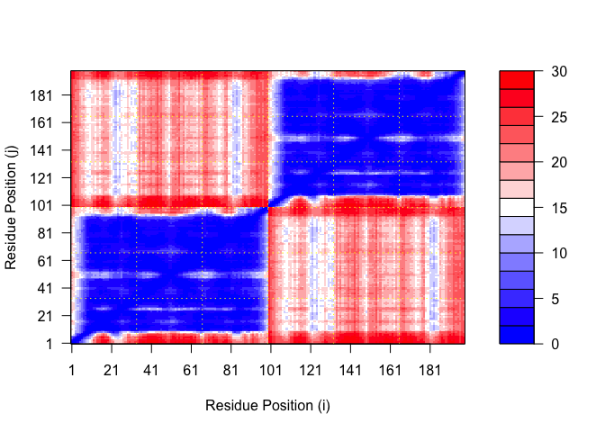
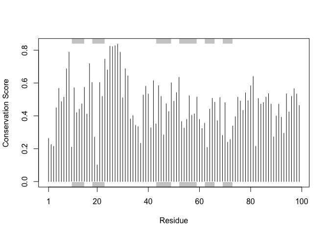

# Class 11: Protein Structure Prediction with AlphaFold
Christopher Leone \| A16731724

- [Generating your own structure
  predictions](#generating-your-own-structure-predictions)
  - [pLDDT Plot](#plddt-plot)
  - [PAE Plot](#pae-plot)
  - [Residue conservation from alignment
    file](#residue-conservation-from-alignment-file)

## Generating your own structure predictions

Here we read the results from AlphaFold and try to interpret all the
models and quality score metrics:

``` r
# Call bio3d
library(bio3d)

# Read in the files
pth <- "HIV_Pr_Dimer_23119/"
pdbfiles <- list.files(path = pth, full.names=TRUE, pattern = ".pdb")
```

Let’s align and superpose all of these models:

``` r
# Adding the models
pdbs <- pdbaln(pdbfiles, fit=TRUE, exefile="msa")
```

    Reading PDB files:
    HIV_Pr_Dimer_23119//HIV_Pr_Dimer_23119_unrelaxed_rank_001_alphafold2_multimer_v3_model_2_seed_000.pdb
    HIV_Pr_Dimer_23119//HIV_Pr_Dimer_23119_unrelaxed_rank_002_alphafold2_multimer_v3_model_5_seed_000.pdb
    HIV_Pr_Dimer_23119//HIV_Pr_Dimer_23119_unrelaxed_rank_003_alphafold2_multimer_v3_model_4_seed_000.pdb
    HIV_Pr_Dimer_23119//HIV_Pr_Dimer_23119_unrelaxed_rank_004_alphafold2_multimer_v3_model_1_seed_000.pdb
    HIV_Pr_Dimer_23119//HIV_Pr_Dimer_23119_unrelaxed_rank_005_alphafold2_multimer_v3_model_3_seed_000.pdb
    .....

    Extracting sequences

    pdb/seq: 1   name: HIV_Pr_Dimer_23119//HIV_Pr_Dimer_23119_unrelaxed_rank_001_alphafold2_multimer_v3_model_2_seed_000.pdb 
    pdb/seq: 2   name: HIV_Pr_Dimer_23119//HIV_Pr_Dimer_23119_unrelaxed_rank_002_alphafold2_multimer_v3_model_5_seed_000.pdb 
    pdb/seq: 3   name: HIV_Pr_Dimer_23119//HIV_Pr_Dimer_23119_unrelaxed_rank_003_alphafold2_multimer_v3_model_4_seed_000.pdb 
    pdb/seq: 4   name: HIV_Pr_Dimer_23119//HIV_Pr_Dimer_23119_unrelaxed_rank_004_alphafold2_multimer_v3_model_1_seed_000.pdb 
    pdb/seq: 5   name: HIV_Pr_Dimer_23119//HIV_Pr_Dimer_23119_unrelaxed_rank_005_alphafold2_multimer_v3_model_3_seed_000.pdb 

``` r
# Viewing the superposition
library(bio3dview)
```

``` r
view.pdbs(pdbs)
```

### pLDDT Plot

``` r
plot(pdbs$b[1,], typ="l", ylim=c(0,100), ylab="pLDDT score")
lines(pdbs$b[2,], typ="l", col="blue")
lines(pdbs$b[3,], typ="l", col="green")
lines(pdbs$b[4,], typ="l", col="orange")
lines(pdbs$b[5,], typ="l", col="red")
```



### PAE Plot

``` r
# Calling jsonlite
library(jsonlite)

# Listing of all PAE JSON files
pae_files <- list.files(path=pth,
                        pattern=".*model.*\\.json",
                        full.names = TRUE)

# Creating objects
pae1 <- read_json(pae_files[1],simplifyVector = TRUE)
pae2 <- read_json(pae_files[2],simplifyVector = TRUE)
pae3 <- read_json(pae_files[3],simplifyVector = TRUE)
pae4 <- read_json(pae_files[4],simplifyVector = TRUE)
pae5 <- read_json(pae_files[5],simplifyVector = TRUE)
```

And now for our plots:

``` r
# Plotting PAE1
plot.dmat(pae1$pae, xlab="Residue Position (i)", ylab="Residue Position (j)")
```


``` r
plot.dmat(pae1$pae, 
          xlab="Residue Position (i)",
          ylab="Residue Position (j)",
          grid.col = "black",
          zlim=c(0,30))
```


``` r
# Plotting PAE5
plot.dmat(pae5$pae, xlab="Residue Position (i)", ylab="Residue Position (j)")
```



``` r
plot.dmat(pae5$pae, 
          xlab="Residue Position (i)",
          ylab="Residue Position (j)",
          grid.col = "black",
          zlim=c(0,30))
```


### Residue conservation from alignment file

``` r
aln_file <- list.files(path=pth,
                       pattern=".a3m$",
                        full.names = TRUE)
aln_file
```

    [1] "HIV_Pr_Dimer_23119//HIV_Pr_Dimer_23119.a3m"

``` r
aln <- read.fasta(aln_file[1], to.upper = TRUE)
```

    [1] " ** Duplicated sequence id's: 101 **"
    [2] " ** Duplicated sequence id's: 101 **"

Let’s plot:

``` r
sim <- conserv(aln)

# Here we can use a sample pdb file:
pdb <- read.pdb("1hsg")
```

      Note: Accessing on-line PDB file

``` r
plotb3(sim[1:99], sse=trim.pdb(pdb, chain="A"),
       ylab="Conservation Score")
```


