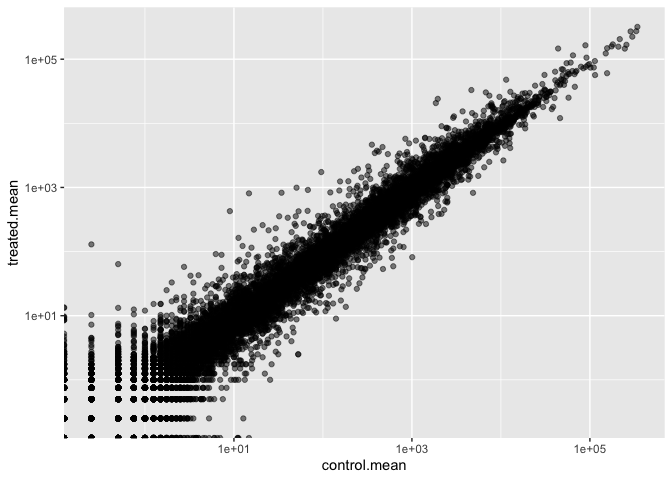
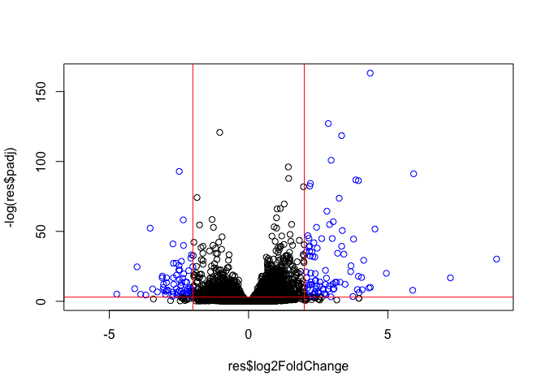
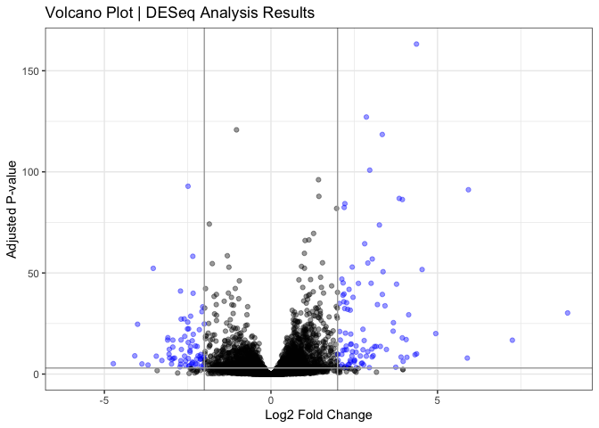

# Class 13 \| RNASeq Analysis
Christopher Leone \| A16731724

- [Background](#background)
- [Toy Differential Gene Expression](#toy-differential-gene-expression)
- [DESeq2 Analysis](#deseq2-analysis)
- [Result Figure: Volcano Plots](#result-figure-volcano-plots)
- [Continued: Class 14](#continued-class-14)
- [Pathway Analysis](#pathway-analysis)

## Background

Today we will analyze some RNA sequencing data on the effects of a
common steroid drug on airway cell lines.

There are two main inputs we need for this analysis:

- `countData`: counts for genes in rows with experiments in the columns
- `colData`: the metadatathat tells us about the design of the
  experiment.

``` r
# Let's (1) load the libraries:
library(BiocManager)
library(DESeq2)

# And (2) import the files:
counts <- read.csv("airway_scaledcounts.csv", row.names=1)
metadata <-  read.csv("airway_metadata.csv")
```

> (Q1): How many genes are in this dataset?

``` r
nrow(counts)
```

    [1] 38694

There are **38,694 genes** in this dataset.

> (Q2): How many control cell lines do we have?

``` r
table(metadata$dex)
```


    control treated 
          4       4 

There are 4 control cell lines in this table.

## Toy Differential Gene Expression

Let’s try finding the average or mean of the “control” and “treated”
columns and see if they differ.

- First, we need to find al “control” columns
- We need to extract just those columns
- Calculate the `mean()` for each gene “control” values4

``` r
# I like the dplyr system, so I will use it here:
library(dplyr)
```

``` r
# (1) Filtering for "control" rows only:
control <- metadata %>% filter(dex=="control")
control.counts <- counts %>% select(control$id) 

# (2) Taking and storing the means, displaying the head
control.mean <- rowSums(control.counts)/4
head(control.mean)
```

    ENSG00000000003 ENSG00000000005 ENSG00000000419 ENSG00000000457 ENSG00000000460 
             900.75            0.00          520.50          339.75           97.25 
    ENSG00000000938 
               0.75 

> (Q3): Do the same for “treated: to get a `treated.mean`.

``` r
# (1) Filtering for "treated" rows only:
treated <- metadata %>% filter(dex=="treated")
treated.counts <- counts %>% select(treated$id) 

# (2) Taking and storing the means, displaying the head
treated.mean <- rowSums(treated.counts)/4
head(treated.mean)
```

    ENSG00000000003 ENSG00000000005 ENSG00000000419 ENSG00000000457 ENSG00000000460 
             658.00            0.00          546.00          316.50           78.75 
    ENSG00000000938 
               0.00 

> (Q4): And create a plot of `control.mean` vs `treated.mean`.

Ultimately, I decided to put this on logarithmic axes due to the
original plot showing most points overlapping. This gives us a much more
useful plot.

``` r
# Let's load the library and make a DF:
library(ggplot2)
means <- data.frame(control.mean, treated.mean)

# Then make the plot:
ggplot(means) + 
  aes(x=control.mean, y=treated.mean) + 
  geom_point(alpha=0.5) + 
  scale_x_log10() + 
  scale_y_log10()
```

    Warning in scale_x_log10(): log-10 transformation introduced infinite values.

    Warning in scale_y_log10(): log-10 transformation introduced infinite values.



A common “rule-of-thumb” is to focus on genes with a log2 “fold-change”
of +/-2. This would indicate a significant up/down regulation.

What if we wanted our axes on a `log2()` scale? Let’s change our
previous plot:

``` r
# We will add a log2 fold-change to a table and make a base plot.
means$log2 <- log2(means$treated.mean/means$control.mean)
```

> (Q5): Remove any “zero count” genes from our dataset for further
> analysis

We end up with 21817 genes that do not have any zero values.

``` r
# We have to omit anything with zero values
to.keep <- rowSums(means[,1:2] == 0) == 0
mycounts <- means[to.keep,]
head(mycounts)
```

                    control.mean treated.mean        log2
    ENSG00000000003       900.75       658.00 -0.45303916
    ENSG00000000419       520.50       546.00  0.06900279
    ENSG00000000457       339.75       316.50 -0.10226805
    ENSG00000000460        97.25        78.75 -0.30441833
    ENSG00000000971      5219.00      6687.50  0.35769358
    ENSG00000001036      2327.00      1785.75 -0.38194109

> (Q6): How many genes are upregulated? What about downregulated?

There are 314 upregulated genes (according to our parameters), and 485
downregulated genes.

``` r
sum(mycounts$log2 >= 2)
```

    [1] 314

``` r
sum(mycounts$log2 <= -2)
```

    [1] 485

## DESeq2 Analysis

Let’s do this properly and consdier the stats—are the differences in the
means significant? Let’s use `DESeq2` for this.

The first function we will use from this package sets up the input in
the particular format that DESeq wants.

``` r
dds <- DESeqDataSetFromMatrix(countData = counts,
                       colData = metadata,
                       design = ~dex)
```

    converting counts to integer mode

    Warning in DESeqDataSet(se, design = design, ignoreRank): some variables in
    design formula are characters, converting to factors

We can now run our DESeq analysis:

``` r
dds <- DESeq(dds)
```

    estimating size factors

    estimating dispersions

    gene-wise dispersion estimates

    mean-dispersion relationship

    final dispersion estimates

    fitting model and testing

``` r
res <-results(dds)
head(res)
```

    log2 fold change (MLE): dex treated vs control 
    Wald test p-value: dex treated vs control 
    DataFrame with 6 rows and 6 columns
                      baseMean log2FoldChange     lfcSE      stat    pvalue
                     <numeric>      <numeric> <numeric> <numeric> <numeric>
    ENSG00000000003 747.194195     -0.3507030  0.168246 -2.084470 0.0371175
    ENSG00000000005   0.000000             NA        NA        NA        NA
    ENSG00000000419 520.134160      0.2061078  0.101059  2.039475 0.0414026
    ENSG00000000457 322.664844      0.0245269  0.145145  0.168982 0.8658106
    ENSG00000000460  87.682625     -0.1471420  0.257007 -0.572521 0.5669691
    ENSG00000000938   0.319167     -1.7322890  3.493601 -0.495846 0.6200029
                         padj
                    <numeric>
    ENSG00000000003  0.163035
    ENSG00000000005        NA
    ENSG00000000419  0.176032
    ENSG00000000457  0.961694
    ENSG00000000460  0.815849
    ENSG00000000938        NA

## Result Figure: Volcano Plots

Here, we will be plotting the adjusted P-values (`padj`) vs the
`log2fc`. We are looking for very small P-values.

``` r
# To color the points:
mycols = rep("black", nrow(res))
mycols[res$log2FoldChange <= -2] <- "blue"
mycols[res$log2FoldChange >= 2] <- "blue"
mycols[res$padj >= 0.05] <- "black"

# The plot:
plot(res$log2FoldChange, -log(res$padj), col=mycols)

# Finally, the boundaries of significant stats:
abline(v=2, col="red")
abline(v=-2, col="red")
abline(h=-log(0.05), col="red")
```



Let’s do better with a `ggplot()`:

``` r
ggplot(as.data.frame(res)) +
  aes(x=log2FoldChange, y=-log(padj)) +
  geom_point(alpha=0.4, col=mycols) +
  geom_vline(xintercept = c(-2, 2), col="darkgray") +
  geom_hline(yintercept = -log(0.05), col="darkgray") +
  theme_bw() +
  labs(title = "Volcano Plot | DESeq Analysis Results", 
       x="Log2 Fold Change", 
       y="Adjusted P-value")
```

    Warning: Removed 23549 rows containing missing values or values outside the scale range
    (`geom_point()`).



## Continued: Class 14

What if we want to add gene symbols so we know what genes we are dealing
with? We first need to “translate” between the ENSEMBL identifiers to
their respective genes.

Let’s load some new packages from `BiocManager`:

``` r
library(AnnotationDbi)
```


    Attaching package: 'AnnotationDbi'

    The following object is masked from 'package:dplyr':

        select

``` r
library(org.Hs.eg.db)
```

What different database ID types can I translate between?

``` r
# We will want to translate between ENSEMBL and SYMBOL.
columns(org.Hs.eg.db)
```

     [1] "ACCNUM"       "ALIAS"        "ENSEMBL"      "ENSEMBLPROT"  "ENSEMBLTRANS"
     [6] "ENTREZID"     "ENZYME"       "EVIDENCE"     "EVIDENCEALL"  "GENENAME"    
    [11] "GENETYPE"     "GO"           "GOALL"        "IPI"          "MAP"         
    [16] "OMIM"         "ONTOLOGY"     "ONTOLOGYALL"  "PATH"         "PFAM"        
    [21] "PMID"         "PROSITE"      "REFSEQ"       "SYMBOL"       "UCSCKG"      
    [26] "UNIPROT"     

So, we need to map between ENSEMBL and SYMBOL ID types to get the data
we want. We will also add two more translations to show the gene names
and their ENTREZ IDs.

``` r
# Translation to gene symbols:
res$symbol <- mapIds(x=org.Hs.eg.db,
                     keys=rownames(res),
                     keytype="ENSEMBL",
                     column="SYMBOL")
```

    'select()' returned 1:many mapping between keys and columns

``` r
# Translation to gene names:
res$genename <- mapIds(x=org.Hs.eg.db,
                     keys=rownames(res),
                     keytype="ENSEMBL",
                     column="GENENAME")
```

    'select()' returned 1:many mapping between keys and columns

``` r
# Translation to gene ENTREZ IDs:
res$entrezid <- mapIds(x=org.Hs.eg.db,
                     keys=rownames(res),
                     keytype="ENSEMBL",
                     column="ENTREZID")
```

    'select()' returned 1:many mapping between keys and columns

``` r
# And a preview:
head(res)
```

    log2 fold change (MLE): dex treated vs control 
    Wald test p-value: dex treated vs control 
    DataFrame with 6 rows and 9 columns
                      baseMean log2FoldChange     lfcSE      stat    pvalue
                     <numeric>      <numeric> <numeric> <numeric> <numeric>
    ENSG00000000003 747.194195     -0.3507030  0.168246 -2.084470 0.0371175
    ENSG00000000005   0.000000             NA        NA        NA        NA
    ENSG00000000419 520.134160      0.2061078  0.101059  2.039475 0.0414026
    ENSG00000000457 322.664844      0.0245269  0.145145  0.168982 0.8658106
    ENSG00000000460  87.682625     -0.1471420  0.257007 -0.572521 0.5669691
    ENSG00000000938   0.319167     -1.7322890  3.493601 -0.495846 0.6200029
                         padj      symbol               genename    entrezid
                    <numeric> <character>            <character> <character>
    ENSG00000000003  0.163035      TSPAN6          tetraspanin 6        7105
    ENSG00000000005        NA        TNMD            tenomodulin       64102
    ENSG00000000419  0.176032        DPM1 dolichyl-phosphate m..        8813
    ENSG00000000457  0.961694       SCYL3 SCY1 like pseudokina..       57147
    ENSG00000000460  0.815849       FIRRM FIGNL1 interacting r..       55732
    ENSG00000000938        NA         FGR FGR proto-oncogene, ..        2268

Be sure to save our annotated results to a file!

``` r
write.csv(res, file="my_annotated_results.csv")
```

## Pathway Analysis

First, we need to load some new packages from our library.

``` r
library(pathview)
```

    ##############################################################################
    Pathview is an open source software package distributed under GNU General
    Public License version 3 (GPLv3). Details of GPLv3 is available at
    http://www.gnu.org/licenses/gpl-3.0.html. Particullary, users are required to
    formally cite the original Pathview paper (not just mention it) in publications
    or products. For details, do citation("pathview") within R.

    The pathview downloads and uses KEGG data. Non-academic uses may require a KEGG
    license agreement (details at http://www.kegg.jp/kegg/legal.html).
    ##############################################################################

``` r
library(gage)
```

``` r
library(gageData)
```

Let’s examine the gageData:

``` r
data(kegg.sets.hs)

# Examine the first 2 pathways in this kegg set for humans
head(kegg.sets.hs, 2)
```

    $`hsa00232 Caffeine metabolism`
    [1] "10"   "1544" "1548" "1549" "1553" "7498" "9"   

    $`hsa00983 Drug metabolism - other enzymes`
     [1] "10"     "1066"   "10720"  "10941"  "151531" "1548"   "1549"   "1551"  
     [9] "1553"   "1576"   "1577"   "1806"   "1807"   "1890"   "221223" "2990"  
    [17] "3251"   "3614"   "3615"   "3704"   "51733"  "54490"  "54575"  "54576" 
    [25] "54577"  "54578"  "54579"  "54600"  "54657"  "54658"  "54659"  "54963" 
    [33] "574537" "64816"  "7083"   "7084"   "7172"   "7363"   "7364"   "7365"  
    [41] "7366"   "7367"   "7371"   "7372"   "7378"   "7498"   "79799"  "83549" 
    [49] "8824"   "8833"   "9"      "978"   

To run pathway analysis, we will use the `gage()` function and it
requires a “vector of importance”. We will use our `log2FC` results from
`res`.

``` r
foldchanges = res$log2FoldChange
names(foldchanges) = res$entrezid
head(foldchanges)
```

           7105       64102        8813       57147       55732        2268 
    -0.35070302          NA  0.20610777  0.02452695 -0.14714205 -1.73228897 

``` r
# And finally, let's run gage!
keggres = gage(foldchanges, gsets=kegg.sets.hs)
```

What is in these results?

``` r
attributes(keggres)
```

    $names
    [1] "greater" "less"    "stats"  

``` r
# What pathways overlap with what we have annotated?
head(keggres$less)
```

                                                             p.geomean stat.mean
    hsa05332 Graft-versus-host disease                    0.0004250461 -3.473346
    hsa04940 Type I diabetes mellitus                     0.0017820293 -3.002352
    hsa05310 Asthma                                       0.0020045888 -3.009050
    hsa04672 Intestinal immune network for IgA production 0.0060434515 -2.560547
    hsa05330 Allograft rejection                          0.0073678825 -2.501419
    hsa04340 Hedgehog signaling pathway                   0.0133239547 -2.248547
                                                                 p.val      q.val
    hsa05332 Graft-versus-host disease                    0.0004250461 0.09053483
    hsa04940 Type I diabetes mellitus                     0.0017820293 0.14232581
    hsa05310 Asthma                                       0.0020045888 0.14232581
    hsa04672 Intestinal immune network for IgA production 0.0060434515 0.31387180
    hsa05330 Allograft rejection                          0.0073678825 0.31387180
    hsa04340 Hedgehog signaling pathway                   0.0133239547 0.47300039
                                                          set.size         exp1
    hsa05332 Graft-versus-host disease                          40 0.0004250461
    hsa04940 Type I diabetes mellitus                           42 0.0017820293
    hsa05310 Asthma                                             29 0.0020045888
    hsa04672 Intestinal immune network for IgA production       47 0.0060434515
    hsa05330 Allograft rejection                                36 0.0073678825
    hsa04340 Hedgehog signaling pathway                         56 0.0133239547

And let’s use the `pathview()` function to look at what the pathway
looks like! Let’s look at asthma, since that was what we have been
investigating.

``` r
pathview(gene.data=foldchanges, pathway.id="hsa05310")
```

    'select()' returned 1:1 mapping between keys and columns

    Info: Working in directory /Users/chrisleone/Desktop/bimm143/bimm143_github/coursework/class13

    Info: Writing image file hsa05310.pathview.png

The image that was generated can be seen here:


