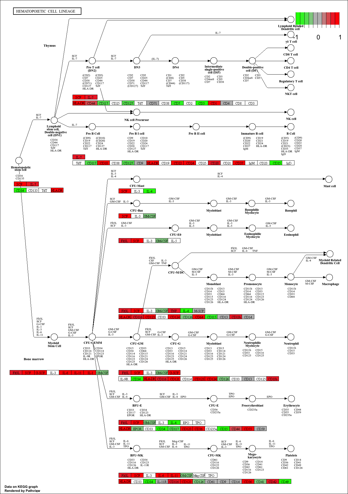
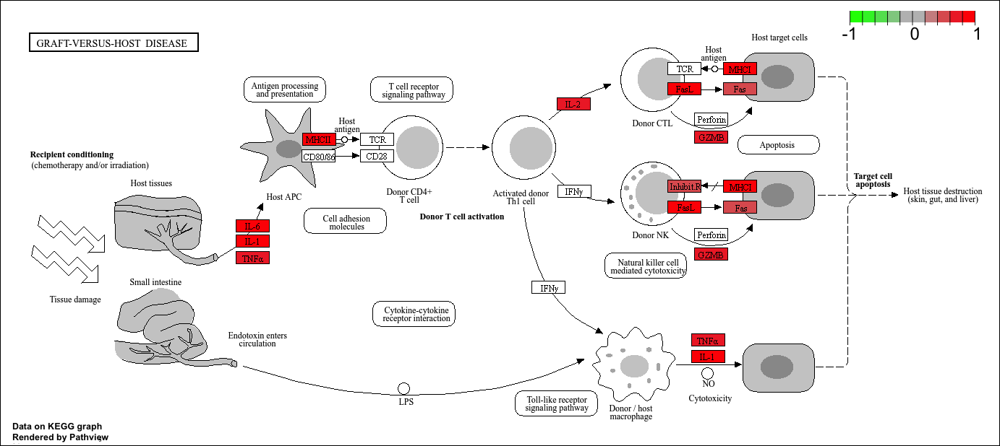

# Class 14: RNASeq Mini-Project
Christopher Leone \| A16731724

- [Loading Files and Packages](#loading-files-and-packages)
- [Tidying the Data](#tidying-the-data)
- [Remove Zero Count Genes](#remove-zero-count-genes)
- [Setup for DESeq Analysis](#setup-for-deseq-analysis)
- [Running DESeq Analysis](#running-deseq-analysis)
- [Extract the Results](#extract-the-results)
- [Add Gene Annotations](#add-gene-annotations)
- [Saving Results to a CSV File:](#saving-results-to-a-csv-file)
- [Result Visualization](#result-visualization)
- [Pathway Analysis](#pathway-analysis)
- [Gene Ontology Subsets](#gene-ontology-subsets)
- [Reactome Analysis](#reactome-analysis)

## Loading Files and Packages

Here we will perform a complete RNASeq analysis from counts to pathways
and biological interpretation.

First, we have to load our packages and read the data into our project:

``` r
# Loading packages:
library(DESeq2)
library(AnnotationDbi)
library(org.Hs.eg.db)
library(pathview)
library(gage)
library(gageData)
```

``` r
# Import metadata:
colData <- read.csv("GSE37704_metadata.csv", row.names=1)
head(colData)
```

                  condition
    SRR493366 control_sirna
    SRR493367 control_sirna
    SRR493368 control_sirna
    SRR493369      hoxa1_kd
    SRR493370      hoxa1_kd
    SRR493371      hoxa1_kd

``` r
# Import countdata:
countData <- read.csv("GSE37704_featurecounts.csv", row.names=1)
head(countData)
```

                    length SRR493366 SRR493367 SRR493368 SRR493369 SRR493370
    ENSG00000186092    918         0         0         0         0         0
    ENSG00000279928    718         0         0         0         0         0
    ENSG00000279457   1982        23        28        29        29        28
    ENSG00000278566    939         0         0         0         0         0
    ENSG00000273547    939         0         0         0         0         0
    ENSG00000187634   3214       124       123       205       207       212
                    SRR493371
    ENSG00000186092         0
    ENSG00000279928         0
    ENSG00000279457        46
    ENSG00000278566         0
    ENSG00000273547         0
    ENSG00000187634       258

## Tidying the Data

Let’s check the correspondance of colData rows and countData columns.

``` r
rownames(colData) == colnames(countData)
```

    Warning in rownames(colData) == colnames(countData): longer object length is
    not a multiple of shorter object length

    [1] FALSE FALSE FALSE FALSE FALSE FALSE FALSE

``` r
colnames(countData)
```

    [1] "length"    "SRR493366" "SRR493367" "SRR493368" "SRR493369" "SRR493370"
    [7] "SRR493371"

We see that we have an unwanted “length” column in `countData`, so let’s
remove it:

``` r
counts <- countData[,2:7]

# Double check that they match:
all(rownames(colData) == colnames(counts))
```

    [1] TRUE

## Remove Zero Count Genes

We will have rows in `counts` for genes that are insignificant to us due
to having no expression. So, let’s clear those genes:

``` r
# If the rowSums() of a gene is 0, let's remove that gene:
to.keep <- rowSums(counts) != 0
cleanCounts <- counts[to.keep,]
```

> How many genes do we have left after cleaning?

``` r
nrow(cleanCounts)
```

    [1] 15975

There are 15975 genes remaining after clearing the empty entries.

## Setup for DESeq Analysis

``` r
# We have to use the very long function here
dds <- DESeqDataSetFromMatrix(countData=cleanCounts,
                              colData=colData,
                              design=~condition)
```

    Warning in DESeqDataSet(se, design = design, ignoreRank): some variables in
    design formula are characters, converting to factors

## Running DESeq Analysis

``` r
# Rewrite the variable with the results:
dds <- DESeq(dds)
```

    estimating size factors

    estimating dispersions

    gene-wise dispersion estimates

    mean-dispersion relationship

    final dispersion estimates

    fitting model and testing

## Extract the Results

We just need to declare a new `res` results variable:

``` r
res <- results(dds)
head(res)
```

    log2 fold change (MLE): condition hoxa1 kd vs control sirna 
    Wald test p-value: condition hoxa1 kd vs control sirna 
    DataFrame with 6 rows and 6 columns
                     baseMean log2FoldChange     lfcSE       stat      pvalue
                    <numeric>      <numeric> <numeric>  <numeric>   <numeric>
    ENSG00000279457   29.9136      0.1792571 0.3248216   0.551863 5.81042e-01
    ENSG00000187634  183.2296      0.4264571 0.1402658   3.040350 2.36304e-03
    ENSG00000188976 1651.1881     -0.6927205 0.0548465 -12.630158 1.43989e-36
    ENSG00000187961  209.6379      0.7297556 0.1318599   5.534326 3.12428e-08
    ENSG00000187583   47.2551      0.0405765 0.2718928   0.149237 8.81366e-01
    ENSG00000187642   11.9798      0.5428105 0.5215599   1.040744 2.97994e-01
                           padj
                      <numeric>
    ENSG00000279457 6.86555e-01
    ENSG00000187634 5.15718e-03
    ENSG00000188976 1.76549e-35
    ENSG00000187961 1.13413e-07
    ENSG00000187583 9.19031e-01
    ENSG00000187642 4.03379e-01

Let’s remake a volcano plot with our new data:

``` r
# To color the points:
mycols = rep("black", nrow(res))
mycols[res$log2FoldChange <= -2] <- "blue"
mycols[res$log2FoldChange >= 2] <- "blue"
mycols[res$padj >= 0.05] <- "black"

# The plot:
plot(res$log2FoldChange, -log(res$padj), col=mycols)

# Finally, the boundaries of significant stats:
abline(v=2, col="red")
abline(v=-2, col="red")
abline(h=-log(0.05), col="red")
```


## Add Gene Annotations

We have to re-annotate the gene data so we have gene symbols, gene
names, and ENTREZ IDs.

``` r
# Translation to gene symbols:
res$symbol <- mapIds(x=org.Hs.eg.db,
                     keys=rownames(res),
                     keytype="ENSEMBL",
                     column="SYMBOL")
```

    'select()' returned 1:many mapping between keys and columns

``` r
# Translation to gene names:
res$genename <- mapIds(x=org.Hs.eg.db,
                     keys=rownames(res),
                     keytype="ENSEMBL",
                     column="GENENAME")
```

    'select()' returned 1:many mapping between keys and columns

``` r
# Translation to gene ENTREZ IDs:
res$entrezid <- mapIds(x=org.Hs.eg.db,
                     keys=rownames(res),
                     keytype="ENSEMBL",
                     column="ENTREZID")
```

    'select()' returned 1:many mapping between keys and columns

## Saving Results to a CSV File:

``` r
write.csv(res, file="class14data.csv")
```

## Result Visualization

``` r
data(kegg.sets.hs)

# Examine the first 2 pathways in this kegg set for humans
head(kegg.sets.hs, 2)
```

    $`hsa00232 Caffeine metabolism`
    [1] "10"   "1544" "1548" "1549" "1553" "7498" "9"   

    $`hsa00983 Drug metabolism - other enzymes`
     [1] "10"     "1066"   "10720"  "10941"  "151531" "1548"   "1549"   "1551"  
     [9] "1553"   "1576"   "1577"   "1806"   "1807"   "1890"   "221223" "2990"  
    [17] "3251"   "3614"   "3615"   "3704"   "51733"  "54490"  "54575"  "54576" 
    [25] "54577"  "54578"  "54579"  "54600"  "54657"  "54658"  "54659"  "54963" 
    [33] "574537" "64816"  "7083"   "7084"   "7172"   "7363"   "7364"   "7365"  
    [41] "7366"   "7367"   "7371"   "7372"   "7378"   "7498"   "79799"  "83549" 
    [49] "8824"   "8833"   "9"      "978"   

``` r
foldchanges = res$log2FoldChange
names(foldchanges) = res$entrezid
head(foldchanges)
```

           <NA>      148398       26155      339451       84069       84808 
     0.17925708  0.42645712 -0.69272046  0.72975561  0.04057653  0.54281049 

``` r
# And finally, let's run gage!
keggres = gage(foldchanges, gsets=kegg.sets.hs)
```

``` r
attributes(keggres)
```

    $names
    [1] "greater" "less"    "stats"  

``` r
# What pathways overlap with what we have annotated?
head(keggres$less)
```

                                                      p.geomean stat.mean
    hsa04110 Cell cycle                            8.995727e-06 -4.378644
    hsa03030 DNA replication                       9.424076e-05 -3.951803
    hsa05130 Pathogenic Escherichia coli infection 1.405864e-04 -3.765330
    hsa03013 RNA transport                         1.246882e-03 -3.059466
    hsa03440 Homologous recombination              3.066756e-03 -2.852899
    hsa04114 Oocyte meiosis                        3.784520e-03 -2.698128
                                                          p.val       q.val
    hsa04110 Cell cycle                            8.995727e-06 0.001889103
    hsa03030 DNA replication                       9.424076e-05 0.009841047
    hsa05130 Pathogenic Escherichia coli infection 1.405864e-04 0.009841047
    hsa03013 RNA transport                         1.246882e-03 0.065461279
    hsa03440 Homologous recombination              3.066756e-03 0.128803765
    hsa04114 Oocyte meiosis                        3.784520e-03 0.132458191
                                                   set.size         exp1
    hsa04110 Cell cycle                                 121 8.995727e-06
    hsa03030 DNA replication                             36 9.424076e-05
    hsa05130 Pathogenic Escherichia coli infection       53 1.405864e-04
    hsa03013 RNA transport                              144 1.246882e-03
    hsa03440 Homologous recombination                    28 3.066756e-03
    hsa04114 Oocyte meiosis                             102 3.784520e-03

## Pathway Analysis

``` r
pathview(gene.data=foldchanges, pathway.id="hsa04110")
```

Once we have done that, we can take a look at our first pathway:

 But, I want
to see the remaining pathways as well, so we can do this with the
following code:

``` r
# Focus on top 5 upregulated pathways here for demo purposes only
keggrespathways <- rownames(keggres$greater)[1:5]

# Extract the 8 character long IDs part of each string
keggresids = substr(keggrespathways, start=1, stop=8)

pathview(gene.data=foldchanges, pathway.id=keggresids, species="hsa")
```

And here are the generated KEGG pathway images:

 
 


## Gene Ontology Subsets

``` r
data(go.sets.hs)
data(go.subs.hs)

# Focus on Biological Process subset of GO
gobpsets = go.sets.hs[go.subs.hs$BP]

gobpres = gage(foldchanges, gsets=gobpsets, same.dir=TRUE)

lapply(gobpres, head)
```

    $greater
                                                 p.geomean stat.mean        p.val
    GO:0007156 homophilic cell adhesion       8.519724e-05  3.824205 8.519724e-05
    GO:0002009 morphogenesis of an epithelium 1.396681e-04  3.653886 1.396681e-04
    GO:0048729 tissue morphogenesis           1.432451e-04  3.643242 1.432451e-04
    GO:0007610 behavior                       1.925222e-04  3.565432 1.925222e-04
    GO:0060562 epithelial tube morphogenesis  5.932837e-04  3.261376 5.932837e-04
    GO:0035295 tube development               5.953254e-04  3.253665 5.953254e-04
                                                  q.val set.size         exp1
    GO:0007156 homophilic cell adhesion       0.1951953      113 8.519724e-05
    GO:0002009 morphogenesis of an epithelium 0.1951953      339 1.396681e-04
    GO:0048729 tissue morphogenesis           0.1951953      424 1.432451e-04
    GO:0007610 behavior                       0.1967577      426 1.925222e-04
    GO:0060562 epithelial tube morphogenesis  0.3565320      257 5.932837e-04
    GO:0035295 tube development               0.3565320      391 5.953254e-04

    $less
                                                p.geomean stat.mean        p.val
    GO:0048285 organelle fission             1.536227e-15 -8.063910 1.536227e-15
    GO:0000280 nuclear division              4.286961e-15 -7.939217 4.286961e-15
    GO:0007067 mitosis                       4.286961e-15 -7.939217 4.286961e-15
    GO:0000087 M phase of mitotic cell cycle 1.169934e-14 -7.797496 1.169934e-14
    GO:0007059 chromosome segregation        2.028624e-11 -6.878340 2.028624e-11
    GO:0000236 mitotic prometaphase          1.729553e-10 -6.695966 1.729553e-10
                                                    q.val set.size         exp1
    GO:0048285 organelle fission             5.841698e-12      376 1.536227e-15
    GO:0000280 nuclear division              5.841698e-12      352 4.286961e-15
    GO:0007067 mitosis                       5.841698e-12      352 4.286961e-15
    GO:0000087 M phase of mitotic cell cycle 1.195672e-11      362 1.169934e-14
    GO:0007059 chromosome segregation        1.658603e-08      142 2.028624e-11
    GO:0000236 mitotic prometaphase          1.178402e-07       84 1.729553e-10

    $stats
                                              stat.mean     exp1
    GO:0007156 homophilic cell adhesion        3.824205 3.824205
    GO:0002009 morphogenesis of an epithelium  3.653886 3.653886
    GO:0048729 tissue morphogenesis            3.643242 3.643242
    GO:0007610 behavior                        3.565432 3.565432
    GO:0060562 epithelial tube morphogenesis   3.261376 3.261376
    GO:0035295 tube development                3.253665 3.253665

## Reactome Analysis

We need to make a little file of our significant genes so that we can
upload to the online reactome webpage:

``` r
# Here are our significant genes:
sig_genes <- res[res$padj <= 0.05 & !is.na(res$padj), "symbol"]
print(paste("Total number of significant genes:", length(sig_genes)))
```

    [1] "Total number of significant genes: 8147"

``` r
# And let's write the file:
write.table(sig_genes, file="significant_genes.txt", row.names=FALSE, 
            col.names=FALSE, quote=FALSE)
```

And here is a diagram of one of the pathways we found:


