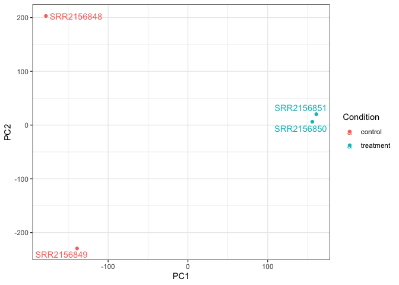
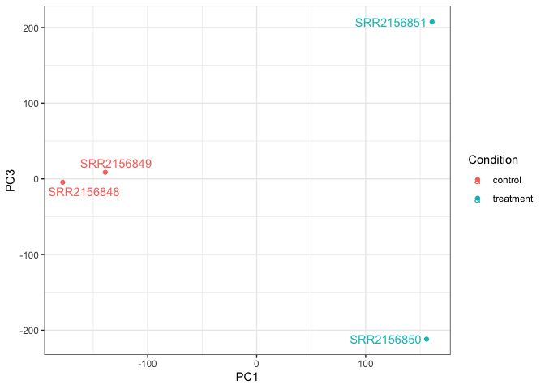
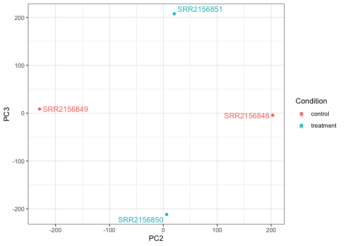

# Class 17: Analyzing Sequencing Data
Christopher Leone \| A16731724

- [Downstream Analysis](#downstream-analysis)
- [Principal Component Analysis](#principal-component-analysis)

## Downstream Analysis

After downloading the `tximport` package, we can directly and easily
read Kallisto results.

``` r
library(tximport)

# Setup the folder and filenames to read
folders <- dir(pattern="SRR21568*")
samples <- sub("_quant", "", folders)
files <- file.path( folders, "abundance.h5" )
names(files) <- samples

txi.kallisto <- tximport(files, type = "kallisto", txOut = TRUE)
```

    1 2 3 4 

``` r
# Taking a look:
head(txi.kallisto$counts)
```

                    SRR2156848 SRR2156849 SRR2156850 SRR2156851
    ENST00000539570          0          0    0.00000          0
    ENST00000576455          0          0    2.62037          0
    ENST00000510508          0          0    0.00000          0
    ENST00000474471          0          1    1.00000          0
    ENST00000381700          0          0    0.00000          0
    ENST00000445946          0          0    0.00000          0

> (Q): How many transcripts do we have for each sample?

The results are shown by `colSums()`.

``` r
colSums(txi.kallisto$counts)
```

    SRR2156848 SRR2156849 SRR2156850 SRR2156851 
       2563611    2600800    2372309    2111474 

> (Q): How many transcripts are in at least one sample?

There were 94,561 transcripts that were present in at least one sample.

``` r
sum(rowSums(txi.kallisto$counts)>0)
```

    [1] 94561

## Principal Component Analysis

Here is some code to filter the results:

``` r
to.keep <- rowSums(txi.kallisto$counts) > 0
kset.nonzero <- txi.kallisto$counts[to.keep,]
```

``` r
keep2 <- apply(kset.nonzero,1,sd)>0
x <- kset.nonzero[keep2,]
```

…Before moving onto PCA.

``` r
pca <- prcomp(t(x), scale=TRUE)

summary(pca)
```

    Importance of components:
                                PC1      PC2      PC3   PC4
    Standard deviation     183.6379 177.3605 171.3020 1e+00
    Proportion of Variance   0.3568   0.3328   0.3104 1e-05
    Cumulative Proportion    0.3568   0.6895   1.0000 1e+00

> (Q): Make PCA Plots of PC1 vs PC2.

First, let’s load in some additonal code. We are loading in the metadata
as well as creating teh dataframe so we can make a `ggplot` rather than
a `base R` plot.

``` r
# Make metadata object for the samples
colData <- data.frame(condition = factor(rep(c("control", "treatment"), each = 2)))
rownames(colData) <- colnames(txi.kallisto$counts)

# Make the data.frame for ggplot 
y <- as.data.frame(pca$x)
y$Condition <- as.factor(colData$condition)
```

Now, here’ PC1 vs. PC2:

``` r
library(ggplot2)
library(ggrepel)

ggplot(y) +
  aes(PC1, PC2, col=Condition) +
  geom_point() +
  geom_text_repel(label=rownames(y)) +
  theme_bw()
```



> (Q): Make PCA Plots of PC1 vs PC3.

The process is the same as before:

``` r
ggplot(y) +
  aes(PC1, PC3, col=Condition) +
  geom_point() +
  geom_text_repel(label=rownames(y)) +
  theme_bw()
```



> (Q): Make PCA Plots of PC2 vs PC3.

The process is the same as before, one final time:

``` r
ggplot(y) +
  aes(PC2, PC3, col=Condition) +
  geom_point() +
  geom_text_repel(label=rownames(y)) +
  theme_bw()
```


