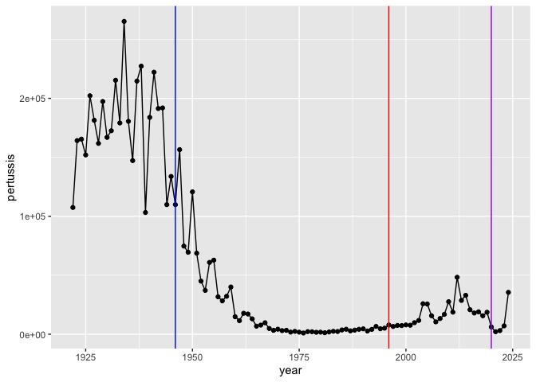
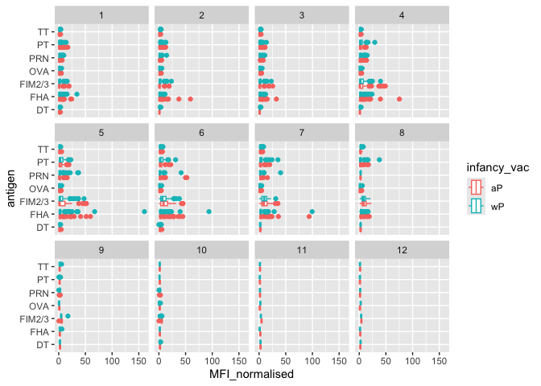
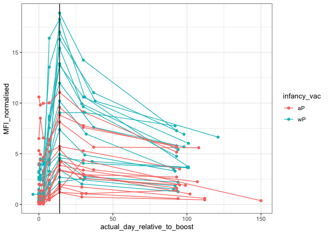

# Class 18: Pertussis Mini-Project
Christopher Leone \| A16731724

- [Background:](#background)
- [Examining Cases of Pertussis by
  Year:](#examining-cases-of-pertussis-by-year)
- [Enter the CMI-PB Project:](#enter-the-cmi-pb-project)
- [Focus on IgG](#focus-on-igg)

## Background:

Pertussis, commonly known as whooping cough, is a common lung infection
caused by the bacterium *Bordetella pertussis*.

The CDC tracks cases of pertussis in the US:
https://tinyurl.com/pertussiscdc

## Examining Cases of Pertussis by Year:

First, we have to scrape the data in from the website using
**DATAPASTA**.

> (Q1): Make a plot of Pertussis cases per year using ggplot.

``` r
library(ggplot2)
cases <- ggplot(cdc) +
            aes(year, pertussis) +
            geom_point() + 
            geom_line()
```

> (Q2): Add some key time points in our graph. These include the years
> when wP was developed (1946) and the switch to aP (1996).

We can use `geom_vline()` to create vertical lines on our graph to
denote these checkpoints.

``` r
cases +
  geom_vline(xintercept=1946, col="blue") +
  geom_vline(xintercept=1996, col="red") +
  geom_vline(xintercept=2020, col="purple")
```



Mounting evidence suggests that the newer **aP** (acellular vaccine) is
less effective over the long term than the original **wP** vaccine. In
other words, vaccine protection wanes more rapidly with **aP**.

## Enter the CMI-PB Project:

The CMI-PD project (Computational Models of Immunity - Pertussis Boost)
aims to investigate how the immune system responds differently in
individuals with the **aP** or **wP** vaccines. The goal is to be able
to predict when the immunity fades so we know the true efficacy of each
vaccine.

CMI-PB makes all of their collected data publicly available and they
store it in a database composed of different tables. Herem, we will
access a few of these.

We can use the `jsonlite` package to read this data.

``` r
library(jsonlite)
subject <- read_json("https://www.cmi-pb.org/api/v5_1/subject",
                     simplifyVector=TRUE)
head(subject)
```

      subject_id infancy_vac biological_sex              ethnicity  race
    1          1          wP         Female Not Hispanic or Latino White
    2          2          wP         Female Not Hispanic or Latino White
    3          3          wP         Female                Unknown White
    4          4          wP           Male Not Hispanic or Latino Asian
    5          5          wP           Male Not Hispanic or Latino Asian
    6          6          wP         Female Not Hispanic or Latino White
      year_of_birth date_of_boost      dataset
    1    1986-01-01    2016-09-12 2020_dataset
    2    1968-01-01    2019-01-28 2020_dataset
    3    1983-01-01    2016-10-10 2020_dataset
    4    1988-01-01    2016-08-29 2020_dataset
    5    1991-01-01    2016-08-29 2020_dataset
    6    1988-01-01    2016-10-10 2020_dataset

> (Q): How many subjects are there?

According to `nrow()`, there are 172 participants in this dataset.

``` r
nrow(subject)
```

    [1] 172

> (Q): How many “aP” and “wP” individuals are there?

Using `table()`, we see that there are 87 aP-vaccinated individuals, and
85 wP-vaccinated individuals.

``` r
table(subject$infancy_vac)
```


    aP wP 
    87 85 

> (Q): How many M/F subjects are in the dataset?

Using `table()`, we see that there are 112 female individuals, and 60
male individuals.

``` r
table(subject$biological_sex)
```


    Female   Male 
       112     60 

> (Q): How many M/F of each race are there in the dataset?

This dataset is dominated by White Females, followed by Asian Females
and White Males.

``` r
table(subject$race, subject$biological_sex)
```

                                               
                                                Female Male
      American Indian/Alaska Native                  0    1
      Asian                                         32   12
      Black or African American                      2    3
      More Than One Race                            15    4
      Native Hawaiian or Other Pacific Islander      1    1
      Unknown or Not Reported                       14    7
      White                                         48   32

> (Q): Is this representative of the US Demographics?

No way! It looks like UC San Diego’s population…

Let’s go read some more data from CMI-PB:

``` r
specimen <- read_json("https://www.cmi-pb.org/api/v5_1/specimen",
                      simplifyVector = TRUE)
ab_data <- read_json("http://cmi-pb.org/api/v5_1/plasma_ab_titer",
                      simplifyVector = TRUE)
head(specimen)
```

      specimen_id subject_id actual_day_relative_to_boost
    1           1          1                           -3
    2           2          1                            1
    3           3          1                            3
    4           4          1                            7
    5           5          1                           11
    6           6          1                           32
      planned_day_relative_to_boost specimen_type visit
    1                             0         Blood     1
    2                             1         Blood     2
    3                             3         Blood     3
    4                             7         Blood     4
    5                            14         Blood     5
    6                            30         Blood     6

``` r
head(ab_data)
```

      specimen_id isotype is_antigen_specific antigen        MFI MFI_normalised
    1           1     IgE               FALSE   Total 1110.21154       2.493425
    2           1     IgE               FALSE   Total 2708.91616       2.493425
    3           1     IgG                TRUE      PT   68.56614       3.736992
    4           1     IgG                TRUE     PRN  332.12718       2.602350
    5           1     IgG                TRUE     FHA 1887.12263      34.050956
    6           1     IgE                TRUE     ACT    0.10000       1.000000
       unit lower_limit_of_detection
    1 UG/ML                 2.096133
    2 IU/ML                29.170000
    3 IU/ML                 0.530000
    4 IU/ML                 6.205949
    5 IU/ML                 4.679535
    6 IU/ML                 2.816431

Let’s join our `subject` and `specimen` tables to get all of our
information together using a **dplyr** function.

``` r
library(dplyr)
```


    Attaching package: 'dplyr'

    The following objects are masked from 'package:stats':

        filter, lag

    The following objects are masked from 'package:base':

        intersect, setdiff, setequal, union

``` r
meta <- inner_join(subject, specimen)
```

    Joining with `by = join_by(subject_id)`

``` r
head(meta)
```

      subject_id infancy_vac biological_sex              ethnicity  race
    1          1          wP         Female Not Hispanic or Latino White
    2          1          wP         Female Not Hispanic or Latino White
    3          1          wP         Female Not Hispanic or Latino White
    4          1          wP         Female Not Hispanic or Latino White
    5          1          wP         Female Not Hispanic or Latino White
    6          1          wP         Female Not Hispanic or Latino White
      year_of_birth date_of_boost      dataset specimen_id
    1    1986-01-01    2016-09-12 2020_dataset           1
    2    1986-01-01    2016-09-12 2020_dataset           2
    3    1986-01-01    2016-09-12 2020_dataset           3
    4    1986-01-01    2016-09-12 2020_dataset           4
    5    1986-01-01    2016-09-12 2020_dataset           5
    6    1986-01-01    2016-09-12 2020_dataset           6
      actual_day_relative_to_boost planned_day_relative_to_boost specimen_type
    1                           -3                             0         Blood
    2                            1                             1         Blood
    3                            3                             3         Blood
    4                            7                             7         Blood
    5                           11                            14         Blood
    6                           32                            30         Blood
      visit
    1     1
    2     2
    3     3
    4     4
    5     5
    6     6

We can also join our `meta` table with our `ab_data`, so we can have one
large dataset.

``` r
data <- inner_join(ab_data, meta)
```

    Joining with `by = join_by(specimen_id)`

``` r
head(data)
```

      specimen_id isotype is_antigen_specific antigen        MFI MFI_normalised
    1           1     IgE               FALSE   Total 1110.21154       2.493425
    2           1     IgE               FALSE   Total 2708.91616       2.493425
    3           1     IgG                TRUE      PT   68.56614       3.736992
    4           1     IgG                TRUE     PRN  332.12718       2.602350
    5           1     IgG                TRUE     FHA 1887.12263      34.050956
    6           1     IgE                TRUE     ACT    0.10000       1.000000
       unit lower_limit_of_detection subject_id infancy_vac biological_sex
    1 UG/ML                 2.096133          1          wP         Female
    2 IU/ML                29.170000          1          wP         Female
    3 IU/ML                 0.530000          1          wP         Female
    4 IU/ML                 6.205949          1          wP         Female
    5 IU/ML                 4.679535          1          wP         Female
    6 IU/ML                 2.816431          1          wP         Female
                   ethnicity  race year_of_birth date_of_boost      dataset
    1 Not Hispanic or Latino White    1986-01-01    2016-09-12 2020_dataset
    2 Not Hispanic or Latino White    1986-01-01    2016-09-12 2020_dataset
    3 Not Hispanic or Latino White    1986-01-01    2016-09-12 2020_dataset
    4 Not Hispanic or Latino White    1986-01-01    2016-09-12 2020_dataset
    5 Not Hispanic or Latino White    1986-01-01    2016-09-12 2020_dataset
    6 Not Hispanic or Latino White    1986-01-01    2016-09-12 2020_dataset
      actual_day_relative_to_boost planned_day_relative_to_boost specimen_type
    1                           -3                             0         Blood
    2                           -3                             0         Blood
    3                           -3                             0         Blood
    4                           -3                             0         Blood
    5                           -3                             0         Blood
    6                           -3                             0         Blood
      visit
    1     1
    2     1
    3     1
    4     1
    5     1
    6     1

> (Q): How many antigen types are measured? (Q): How many total antigens
> are there in the data?

Out of our 61956 antigens measured in the dataset, there are 15 studied
antigens.

``` r
table(data$antigen)
```


        ACT   BETV1      DT   FELD1     FHA  FIM2/3   LOLP1     LOS Measles     OVA 
       1970    1970    6318    1970    6712    6318    1970    1970    1970    6318 
        PD1     PRN      PT     PTM   Total      TT 
       1970    6712    6712    1970     788    6318 

``` r
nrow(data)
```

    [1] 61956

> (Q): Make a boxplot of antigen levels across the whole dataset.

``` r
ggplot(data) +
  aes(MFI, antigen) +
  geom_boxplot()
```

    Warning: Removed 1 row containing non-finite outside the scale range
    (`stat_boxplot()`).


> (Q): Are there obvious differences between **aP** and **wP**
> individuals?

``` r
ggplot(data) +
  aes(MFI, antigen, col=infancy_vac) +
  geom_boxplot()
```

    Warning: Removed 1 row containing non-finite outside the scale range
    (`stat_boxplot()`).


## Focus on IgG

Here, we can use a filter to focus on the most abundant immune antigen
-\> IgG.

Let’s make a similar boxplot of antigens.

``` r
## Defining IgG
igg <- data |> filter(isotype == "IgG")

## Making the plot
ggplot(igg) +
  aes(MFI_normalised, antigen, col=infancy_vac) +
  geom_boxplot() +
  facet_wrap(~visit)
```



Let’s zoom in even further on PT (pertussis toxin) levels over time,
within the **2021 dataset**.

``` r
# Filtering the data
pt <- data |> filter(isotype=="IgG",
                     antigen=="PT",
                     dataset=="2021_dataset")
# Creating a plot
ggplot(pt) +
  aes(actual_day_relative_to_boost,
      MFI_normalised,
      col=infancy_vac,
      group=subject_id) +
  geom_point() +
  geom_line() +
  theme_bw() +
  geom_vline(xintercept=14, col="black")
```


